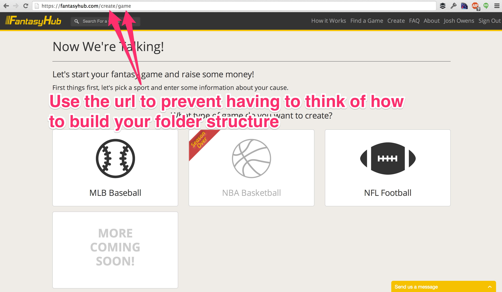

I love Meteor.js. One of the more fun and simultaneously frustrating aspects of the platform is the lack of any standards when it comes to 'How to organize your Meteor.js app'. Having worked on apps from scratch ([green-fielded](http://en.wikipedia.org/wiki/Greenfield_project)) and having taken over existing apps, I start to realize why having good file names and a proper file structure can really help.

### Spacebars Template file naming

The established project I recently took over had the file naming part of organizing a meteor app wrong. When I go into a folder call `client/views/nav` and I am looking for a file named `navGuest.html` so I can fix up some css classes, but all I saw were a bunch of files that started with `role_user.html`, `role_guest.html`, etc. While this puzzle was slightly easier to deduce, I wanted the `role_guest.html` file, others haven't been so obvious at first glance.


The important thing here is that only **one template** belongs in a file and you should have that file **be named the same** as the template inside.

### How to organize your folders for Meteor.js

From a high level, Meteor.js gives you four folders that are treated special by the build tool: `client`, `public`, `server`, and `test`. Anything not in those special folders will be compiled by the build tool and sent to both the client and the server. This is where guidance from the Meteor Development Group stops.

````
client
     └── compatibility # Put certain libraries here like bootstrap.js.
     └── stylesheets # Put your stylesheets here
     └── views # Put all your templates and template helpers/event maps here

````

So we start with the special case of `client/compatibility`, this is where you put any special files that you don't want meteor to wrap up in a new variable scope. This folder is also loaded first before other normal javascript files. If you are using jQuery plugins or things like bootstrap, this might be where you need to put `bootstrap.js` for example.

The stylesheets folder is pretty self explanatory, so let's dive into the views folder! I've put together a simple to follow rule that makes it easier for a team of developers to follow and easily apply. This rule made it easy to switch developers from one project to the next and feel at home with code. The rule is; **folder structure and file naming** should match the **url in your browser**. The goal of this rule is to make it so anyone can glance at the url and parse out where the file should be. Not following me? Look at this example from my favorite project, [FantasyHub](https://fantasyhub.com/):



So we see that the path in the url is `create/game`. Based on the url structure and my rule above, our folder structure would look like:

````
client
     └── views
             └── create
                      ├── createGame.html
                      ├── createGame.coffee
                      └── createGame.less

````

And inside that html, you can name the template `<template name="createGame">`, we will save the 'game' template name in case we want to build a partial in the folder, like so:

````
client
     └── views
             └── create
                      ├── createGame.html
                      ├── createGame.coffee
                      ├── createGame.less
                      ├── _game.html
                      ├── _game.js
                      └── _game.css

````

We have a concept of a game object in the database so now we can easily iterate over those and call the `_game` partial like so:

```
{{#each games}}
  {{> _game}}
{{/each}}
```

What is really interesting is what to do when you have more than one parent template iterating over a game object? Let's move anything that shows up in more than one parent into a shared folder:

````
client
     └── views
             └── shared
                      ├── _game.html
                      ├── _game.js
                      └── _game.css

````

The goal of this shared folder is to **reduce the number of places you have to check for a file to two spots or less**. Because we were already in the `client/views/create` folder, we would look there first for `_game.html`, but when we don't see it, we know to check `client/views/shared` next.

### Template specific styles

You may have noticed the existence of .less files next to the html and coffeescript files. The reason for that is because it makes more sense to **keep your template specific css right next to the template it applies to**. This helps to reduce the size of your main css file while also reducing thinking about where the css might be located. I also make sure that I wrap the template up with a div like `<div class="game">` so that it will make targeting the css in the template specific stylesheet much easier.

### Heavily borrowed structure

Some of these structures I've borrowed from Ruby on Rails. Having spent 9+ years working with that framework, these conventions just seem to come naturally to my way of thinking about building a web app. So to highlight my best practice tips for organizing your Meteor app:

* Keep template names and file names in sync
* Use iron-router url paths to determine your folder structure
* Start reusable partial templates with `_` and keep them in shared if more than one parent uses it
* Keep template specific styles next to the template, targeted specifically to that template using ids and classes.

I hope these rules help you as much as they helped me and a team of 5 developers in [building 40+ Meteor.js apps this past year](http://joshowens.me/what-ive-learned-from-a-year-with-meteor-js/).
