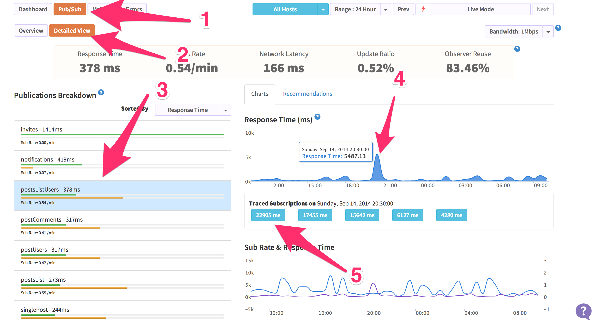

Having helped setup and deploy 40 apps with my old team, I've learned a trick or two about what it takes to handle some traffic. Meteor is a little different than traditional 'static html' frameworks. The Meteor platform uses things like web sockets, DDP, and a pub/sub model to get data in the right spot. That means we can't just throw varnish in front of an app and get our 'magic scaling beans'.

### Scaling key #1: Oplog support

The most important foundation for scaling your meteor app is Oplog support. By turning it on, you can reduce the CPU usage of any meteor process. The reason for the reduction is because each Meteor app doesn't have to run a [poll and diff](https://github.com/meteor/meteor/wiki/Oplog-Observe-Driver). In my experience with Poll and Diff, you can end up with a Meteor server that has 85% CPU usage. When I've enabled those same apps with Oplog support, I've seen the CPU usage drop under 10% consistently on [Modulus](http://modulus.io).

Why does Oplog cut the CPU so drastically? Instead of running a loop inside the Node.js process to detect data changes, our Meteor process now acts like a replica slave and subscribes to the replica set operations log (oplog) to get it's changes. Mongo is doing all the hard work to help us reduce our CPU usage.

### Scaling key #2: Scale horizontally with Meteor

Now that we have an easy way to get those real-time changes from Mongo itself with minimal effort, we can start to [scale out horizontally](http://en.wikipedia.org/wiki/Scalability#Horizontal_and_vertical_scaling). Horizontal scaling is important because we can take advantage of multiple CPU cores on a system by spinning up more Meteor processes - or we could add more servers and spin up more Meteor processes on those servers. Adding more processes use to mean waiting around 10 seconds to get those 'real-time updates' from Mongo.

Why do you gain with more Meteor processes? The ability to handle more client DDP connections, a connection that every user starts when a browser connects. On 1 Modulus servo with a simple blog application, prior to Oplog support, we were able to handle around 700 active connections before we started to run into trouble. One restaurant Meteor app that deals with a large onslught of daily traffic around lunch time, with oplog enabled DB, deals with around 400-500 active connections at a time. The restaurant just bumps the servo count on Modulus to 2 before lunch time.

### Scaling key #3: Use Kadira

Now that we've reduced our CPU usage & scaled our app horizontally to handle more real-time connections - we should optimize the DDP pub/sub data, right? Of course! The best way to get started with optimizing your pub/sub is by adding Kadira and deploying. Kadira is an app analytics tool that will collection information from your running Node.js process and ship those stats back to the Kadira server for processing and analytics. When you log in to Kadira, you can click on the Pub/Sub button and start diving in to each subscription that is being made. 

Once you get some data flowing in, go to Pub/Sub tab and click on the detailed view. From there, you can sort by response time, click the top publication, and then click on a point in the top right graph. You should see a list of actions, clicking on one will give you a break down of the publication that ran and how long it spent on each line of code. 

Check out this [breakdown of crater](https://ui.kadira.io/pt/376372fc-c712-416f-92e1-eaba9bb3a879). Guess **I** should add oplog support! There is also a recommendation tab that shows you how much time and bandwidth you might save by reducing the amount data in each publication.

### Publications are the lifeblood of Meteor

Why is the pub/sub architecture so important in a Meteor app? It is the way you get reactive data in your Meteor app, by default. Generally every client that connects will make a DDP connection and data will start flowing. This has far reaching implications for anything you do in the Meteor publications. Publications are the crux of your data combinations, outbound data security, and the core of any scaling issues you might run into.

Consider something like the [MergeBox](https://meteorhacks.com/understanding-mergebox.html) on a Meteor server. If you publications are too big or you are getting too many publications with a ton of different data, the MergeBox has the ability to chew up memory on the Node.js process. On a platform like Heroku or Modulus, they may hard kill your running app and restart it when it hits a memory limit.

I plan to explore more of the facets of publications in a future article. If you are just getting started with Meteor, consider joining my upcoming ['Mastering Meteor.js class'](http://meteorjs.club/learn/) that starts in a few weeks - I only have 1 seat left!
