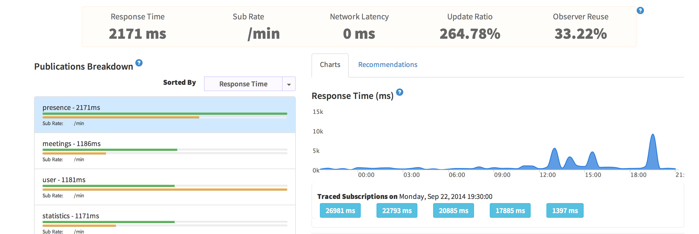

**Update**: I've added a video on youtube that shows how to use Mongo 3.0+ w/ the queryPlanner now.

<iframe width="560" height="315" src="https://www.youtube.com/embed/z9-9PCaEpbU" frameborder="0" allowfullscreen></iframe>

I recently have switched to doing freelance work and one of the companies I am doing work for is [MeetingHero](http://www.meetinghero.com/). They have a Meteor app that allows people to collaborate in real time to build a meeting agenda, record notes and decisions, and create action items while you are in a meeting. The first time I saw MeetingHero, I was really impressed with what looked like a great use case for Meteor! Fast forward a few months later and now I am elbow deep in the inner workings of MeetingHero and I have been focused on improving performance and reducing the amount of time you see the 'Loading...' message when you pull up a meeting.


## Finding your bottlenecks

The first thing I did once I knew we had performance problems, was to install Kadira. The amount of insight and analytics you get from Kadira is worth every penny, especially when you are trying to optimize for production. Once I installed and deployed the app with Kadira in it, the app started sending back the metrics from the running meteor app.

As I've said before, publications are the life blood of your meteor app. I started by going to the Pub/Sub detailed tab in Kadira and switched to sort by response time. I quickly noticed that one publication had the second highest subscribe rate and an average response time of 2171ms - that signaled a pretty big bottleneck for me.



Looking at the publication code, I was able to deduce what the query might look like:


```
	Meteor.presences.find({ userId: userId }, { fields: { state: true, userId: true }});
                               
```

I opened Robomongo and looked at the local copy of the database and checked the indexes to find only _id had an index on it. Then I ran an explain on the query to see what came back:

```
db.presences.find({userId: 1}).explain()
```

Which returned:

```
{
    "cursor" : "BasicCursor",
    "isMultiKey" : false,
    "n" : 0,
    "nscannedObjects" : 1,
    "nscanned" : 1,
    "nscannedObjectsAllPlans" : 1,
    "nscannedAllPlans" : 1,
    "scanAndOrder" : false,
    "indexOnly" : false,
    "nYields" : 0,
    "nChunkSkips" : 0,
    "millis" : 0,
    "indexBounds" : {},
    "server" : "zeruel.local:3001"
}
```

Getting back a 'BasicCursor' is not what we want here, we actually want a 'BTreeCursor' which would indicate that we used the index to find the records. BasicCursor means it has to scan more records than it should to find a match.

## Removing your bottleneck

Now that we know what we need to fix, let's put in a simple one line of code and wrap it with Meteor.statup to ensure it runs when the server boots up. Keep in mind the method name starts with `_`, so that denotes that Meteor Development Group hasn't documented the method and they consider it private - use at your own risk :)

```
Meteor.startup(function () {
  Presences._ensureIndex({ "userId": 1});
});
```

When the local Meteor server starts back up the presences collection should have an index on it for userId now. Let's try the explain again:

```
{
    "cursor" : "BtreeCursor userId_1",
    "isMultiKey" : false,
    "n" : 0,
    "nscannedObjects" : 0,
    "nscanned" : 0,
    "nscannedObjectsAllPlans" : 0,
    "nscannedAllPlans" : 0,
    "scanAndOrder" : false,
    "indexOnly" : false,
    "nYields" : 0,
    "nChunkSkips" : 0,
    "millis" : 0,
    "indexBounds" : {
        "userId" : [ 
            [ 
                1, 
                1
            ]
        ]
    },
    "server" : "zeruel.local:3001"
}
```

Notice we got the 'BtreeCursor' this time? Huzzah, that is just what we wanted! You can see when we use an index our nscannedObjects and nscanned dropped to 0 instead of 1. If you run the explain on a real production database, your nscanned will be more realistic and should give you a better idea of how bad your performance issues might be. My development environment is still able to help me understand that I've fixed the problem at least.

Curious what the performance is like after the fix was deployed to production? Check out this 15X performance increase:


## Learn Mongo

I noticed that Robomongo reported 0 indexes for the user collection, which shocked me because I would think MDG would have thought about performance on something like the user collection. Turns out they did, but Robomongo doesn't seem to pick up indexes on subarray, embedded documents, etc. If you want to be completely sure about indexes on a collection just run `db.users.getIndexes()` and you will see that the collection actually has around 14 indexes on it! MDG added most of the indexes we needed for production, so kudos to them. I did add an index for `services.google.email` so our user lookup by email would go faster.

If you want to learn more tips and tricks for Meteor, be sure to check out my class on [Mastering Meteor.js](http://meteorjs.club/learn).
