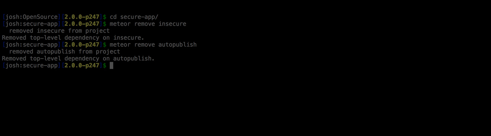

When I was part of the team at Differential, we spent a lot of time thinking about best practices with a focus security and the implications of the data we exposed in publications. Having recently worked on projects that weren't build by Differential, I am starting to be exposed to other code and practices that other programmers may be following. I wanted to go over some of the common security holes I have found recently, why they happen, and how you avoid them!


### Remove autopublish and insecure

I know some of you may read this and say 'Pfft, everyone knows that!', but I really found an app in production running with insecure still in the package list. Insecure and Autopublish are two 'crutch' packages that come installed by default to make initial development a little faster and easier. 

Autopublish serves up all the data in your database to the client. This actually has both security implications, through too much exposed data, and potential performance issues because publishing everything could overload the server and pushing too many records to the client side at once will cause it to lock up for a few seconds while it all loads. 

**Recommendation**:

```
meteor remove autopublish
```

then setup server/publications.js:

```
Meteor.publish('bigData', function() {
  return BigData.find({userId: this.userId})
});
```

Insecure allows all clients to update anything in the database that they want. Obviously for the majority of applications (read: 99.99%) you want to have a little security and authorization built in to creating and updating database information, so removing insecure is a pretty natural step. Let's continue with the BigData example and only allow logged in users to create data, and then only the owner can update or delete the data.

**Recommendation**:

```
meteor remove insecure
```

then I recommend you add these lines to your collection file:

```
BigData.allow({
  insert: function (userId, doc) {
    return userId;
  },
  update: function (userId, doc, fields, modifier) {
    // can only change your own documents
    return doc.userId === userId;
  },
  remove: function (userId, doc) {
    // can only remove your own documents
    return doc.userId === userId;
  }
});
```

With the allow/deny rules, you can actually take it a step further and run a deny check that can return true to deny certain situations. Let's deny anyone that tries to update the document userId:

```
Posts.deny({
  update: function (userId, docs, fields, modifier) {
    // can't change owners
    return _.contains(fields, 'userId');
  }
});
```

As you can see, you can get a pretty powerful set of authorizations setup on your data to make sure the right people mess with the right data.

### Don't over-publish your data

Over publishing data is a pretty common mistake I see in apps. The most common place I see this happen is when you need to pass along a publication with users attached to it. For instance, you have a list of games and each game has a group of users attached. Maybe you want to show the profile picture of each user and have their username show up on hovering the picture... So you create a publication like so:

```
Meteor.publish('gameAttendees', function(ids) {
  return Meteor.users.find({_id: {$in: ids}})
});
```

Looks harmless right? Yeah, it would seem so, until you go into your browser console and type `Meteor.users.find({}).fetch()` and inspect the records that come back. You've just published all the data for any users attached to games, such as oauth tokens, bcrypted password hash, resume tokens, etc. This move will earn you the nickname 'LinkedIn' from your peers :)

This is an honest mistake that most of us have made because we don't realize how much data is stored in the user record, but it is easy to fix! Just tell your find call to only publish the data you need:

**Recommendation**:

```
Meteor.publish('gameAttendees', function(ids) {
  return Meteor.users.find({_id: {$in: ids}}, {fields: {'profile.pictureUrl': 1, username: 1}});
});
```

By using the fields option and passing in '1' on the fields we want, we will only get that specific data published via the publication. If you pass 0 instead, you can remove certain parts of data from the publication results instead.

You've been warned... No one really wants the nickname 'LinkedIn', do they?

### Be very careful with selectors

This is more of a minor issue that I ran into with Minimongoid, but I thought I would toss it out in case anyone might run into it. When you use something like a `Users.findOne()` call, it will return the first match that it finds. Normally this isn't an issue, but let's say you are using an beforeInsert callback hook to add the userId on to the mongo document. The issue crops up when you use Minimongoid's findOne equivalent `first()`. Observe:

```
Report.before.insert(function (userId, doc) {
  doc.createdAt = Date.now();
  doc.userId = Users.first(userId)._id;
});
```

The problem is first somehow wrapped the find or findOne call under the hood and doesn't account for a null or undefined string. We've essentially just called `Users.findOne()`, which will match any old record it finds and return thats as our id. This would be very bad and would lead to Data leakage! Instead, make sure you get in the habit of wrapping your queries with the fields you want to match against. The cleaner/less buggy was to do the above.

**Recommendation**:

```
Report.before.insert(function (userId, doc) {
  doc.createdAt = Date.now();
  doc.userId = Users.first({userId: userId})._id;
});
```

And now our find will only return a match if the userId matches what we passed in.

### The bottom line

I know I've said this a lot before, but your publications are the heart and soul of your application! If you want to learn more, feel free to check out my [Mastering Meteor.js class](http://meteorjs.club/learn), hit me up on [airpair](http://airpair.me/joshowens), or just join my mailing list and reply to my emails.

Right now, go take an extra few minutes and think through the implications of your publications with their find and findOne calls, pay attention to what you return, and **please** remove autopublish and insecure.


