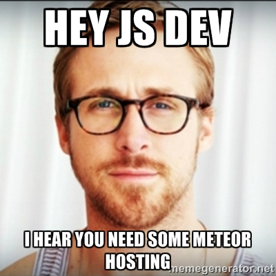

One Meteor.js Club member wrote in and asked me "Where do you usually host your meteor apps?" and I thought that would make a great topic for a blog post. I've spent the past 18 months putting sites up for various client and personal projects. I've had the chance to learn and understand Meteor.js performance on over 40 apps. On top of that, I've had the chance to try out a few different hosting options.

When it comes to the three hosting services you do need to consider memory and CPU usage because each of them handles those limits differently. When building and hosting a Meteor app you need to think about memory usage on the server for things like the Merge Box and running PhantomJS for SEO purposes.

I decided to take [Crater](http://crater.io) on a little hosting safari and run the app in production for at least a few days on each of these services. Read on to find out what happened...

### Modulus.io

[Modulus](http://modulus.io) is a great option for Meteor, they started their company with a complete focus on node.js, because Meteor uses node.js on the back-end. They created a handy tool called demeteorizer to take a standard Meteor app and turn it into a regular node.js app that can run on the Modulus platform. One of the great features of Modulus is that they offer 'servos', which is a fancy word for running a Meteor.js process. The reason a servo is so great is that the Modulus admin web app gives you a slider to increase or decrease servos easily. When you combine the servos with Oplog support in your Mongodb hosting, it makes scaling your Meteor site pretty easy - which is an important thing to consider.

#### Limits

They've also recently added the ability to control the size of your servo limits and you can setup autoscaling rules to scale up or down based on traffic. These are important features to have, I've seen specific instances when hosting on Modulus that this would be beneficial. A few months ago, one of my favorite clients called me and had trouble with Modulus hard restarting their instances for hitting memory limits. Turns out there was a bug in Knox handling file uploads on the server. The issue was solved by doing client-side uploading to s3, but it could have been quickly fixed by moving to bigger servos if they option had been out!

#### Routing

Another great feature that modulus offers is their routing setup. I've had a few discussions with Brandon (their CTO) about how their routing is setup. The thing about routing and Meteor.js, is that Meteor expects you will stay connected to the same app instance while you have the site loaded. I believe it uses some of the app server info when it calculates the hot code reloading information and if the client connects to a different server, it may cause a hard page refresh. Modulus offers sticky sessions with their routing, so you can be sure your clients stay connected to the right servo.

#### Support

With Modulus they have a number of ways to contact them including: email, twitter, IRC, and a phone number on their website. I have used their email support before and they did a good job of getting back to me within an hour or two with a response or questions for me to answer to help them dig in. Their responses have been knowledgeable and friendly so far.

#### Getting started

If you want to use Modulus (and you should), just sign up and use the modulus command line tool to `modulus deploy`. They don't fully integration the database creation process, so you need to create a database in their UI. You can then take the mongo uri they give you and then set it as the `MONGO_URL` and then add a `ROOT_URL`, then you are off to the races!

### Heroku.com

[Heroku](http://heroku.com) has a similar offering to Modulus but they offer what they call a buildpack. A build pack is a way to customize the steps it takes to build and run the web app process. There are several buildpacks people have built to work with Meteor.js. I normally would suggest starting with [the Meteorite buildpack](https://github.com/oortcloud/heroku-buildpack-meteorite), but it doesn't seem to be maintained anymore. Instead you can now use the ['Horse' buildpack](https://github.com/AdmitHub/meteor-buildpack-horse), I've had success with using that now that 1.0 is out.

#### Limits

Heroku has a stated limit of 512mb for their 1x Dyno (the free tier) and they will give you a hard restart if you are 5x that at 2.5GB. When you do hit limits, Heroku will restart your app with an error code of R15 in the logs. Hard restarts without warning are never great for your app.

#### Routing

This is really where I have problems with heroku, the routing layer. While they do offer web socket support, the problem with their routing is based more about their sticky session handling. Since they don't support sticky sessions (on websockets and DDP) so you may run into the random page reloading issue I mentioned above.

#### Support

Heroku has an interface for submitting issues in their dashboard. I have used their support interface before and it works fine, but I did find that they are very slow to respond to issues (6+ hours) but it has been a long time since I actually needed to contact them for anything.

#### Getting started

Heroku is free for your first 'dyno' on their service, so if you want to put up something quick it can be a great option. The buildpack specifies that you need a Mongo database, so it installs a free Compose database and sets the `MONGO_URL` for you. Just make sure you set the `ROOT_URL` environment variable and you should be all set.

### Digital Ocean

If you are not afraid to get your hands a little more dirty, [Digital Ocean](https://www.digitalocean.com/?refcode=2fb9d926fd4b) (if you use the link to sign up, I will get referral credit) is a very affordable option that offers great performance. I decided to run my own setup on Digital Ocean by using the Meteor Up tool, which was pretty easy to get going.

#### Limits

The limits with Digital Ocean are started up front when you buy the VPS package from them, I chose to start with a 512mb to keep the comparison fair and inline with the other services. The issue with hitting limits on Digital Ocean is how they are manifested - hard locks w/ 100% CPU spike. After moving my app fully to Digital Ocean, I started to get alerts from my uptime monitor that the site was going down. Turns out that PhantomJS was spinning up when GoogleBots would start indexing the site and they would overwhelm the box by eating up all the memory and spiking the CPU at 100%. I shut down the box and bumped the memory up to 1gb - it has been running for 9 days without incident now.

#### Routing

Meteor up gives you a bare Meteor app just running on whatever port you want, so I started by running it on port 80. To get a more even comparison, I decided to put a routing layer in front of the Meteor app by using Nginx and proxying requests to the Meteor app. This setup would allow me to easily setup multiple processes and load balance across them if I wanted. I've had no problems using this setup so far.

#### Support

Digital Ocean has an interface for support in their dashboard, very similar to what the Heroku dashboard offers. I have used their before and I generally get a response in 1-2 hours max (which is much faster than heroku), so I find them to be very responsive. When I had the issues with Crater hitting the CPU spikes, they did a good job with responding and suggesting fixes for their platform. Despite the issue being in my code, their suggestions did work and resolved the issue.

#### Getting started

This is the one area that will be a little harder than the other two options. I selected the Ubuntu 14.04 image and then just followed the directions on the Meteor Up README to get started. I did opt to no install Mongo and I instead hosted an Oplog enabled database on Compose.io as I moved the site (Crater.io) around to the different services for testing. I would highly recommend this option if you feel confident enough with a unix command line and Nginx configs.

### My recommendation

I often get asked "Where should I host my Meteor.js app?", and I have two standard answers. My first question is, do you want a bare VPS or a platform that you can push up to. If you feel comfortable with things like configuring Mongo and Nginx, they I would recommend Digital Ocean. If you want something with a little more 'support' available and a bunch of things already configured for you, I would recommend Modulus.

Like this post and want to learn more about Meteor? Try out my [Mastering Meteor.js class](http://meteorjs.club/learn).

