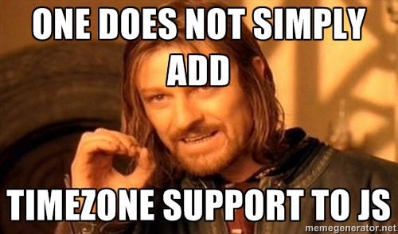
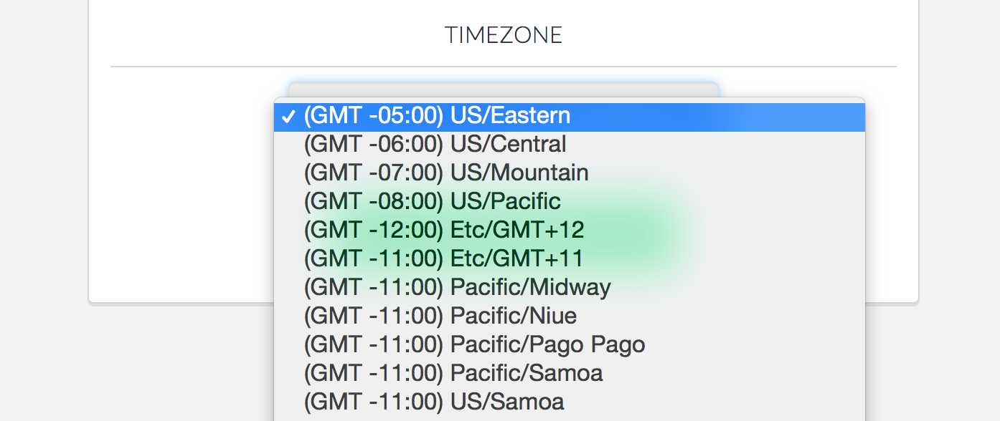

I often write about Meteor.js specific topics, but today I am going to dive into a more general javascript topic - Timezones. I can already hear most of you, "Just use Moment.js because it makes handling time easy..." I agree, it does! But I am talking more specifically about dealing with timezones and offsets.



### The offset

The browser doesn't have the concept of a timezone available, just an offset. We can run some code like so `new Date().getTimezoneOffset()` and on my computer I get back an offset of 300. Perfect! I can feed moment the zone offset like so `moment().zone(300)` and now my time will be scoped to the right timezone, right? Well, yes, for about half the year. What happens if a user logs in during standard time and you save the offset, then you use that offset to send out emails every day at 8am local time? That email starts sending at the wrong hour once daylight savings kicks in, in the springtime. Why? Because the offset number from GMT has changed during daylight savings time.

There has to be a better way to detect and deal with timezones, right?

### jsTimezone

Enter jsTimezone. This is a neat little library that basically does some sudoku-like deductions to figure out when you are in daylight savings or when you are in standard time based on setting the date forward to June and January and checking the offsets. It then determines if you are in the northern or southern hemisphere and then it is able to figure out your timezone! You can add this block of code to your app after you add the library:

```js
findTimezone = function() {
  var tz = jstz.determine();
  return tz.name();
}
```

It makes me sad that in this day and age we can't just have JS return a timezone string, but I am sure glad that someone put together and shared this library! Now when I run this code I get "America/New_York" back as the result - my timezone.

### Moment Timezone

Now that we have a timezone string, we can start using the wonderful moment-timezone library to actually scope our times to the proper timezone. Instead of calling zone on a moment object, we get a tz method: `moment().tz('America/New_York')`. The tz method will handle translating the time it was given into the timezone you want. The great part is that moment-timezone knows how to handle daylight savings and standard time for you, so we no longer have the issue of sending our email out at the wrong time.

### But wait, what if I don't want automated detection all the time?

The above libraries are great for automating the timezone detection and outputting times in the right timezone for you. But what happens when your user wants to set their own timezone instead of automatic detection? The client that had me build and figure out this timezone stuff was familiar Rails and wanted a nicely formatted list of timezones for a select box. After a little searching around and trying a few solutions, we settled on using moment-timezone as the basis for building a dropdown, using underscore.

Now when we want to add a form field to the profile settings page, you just need to include a spacebars call for the timezonePicker: `{{> timezonePicker class="form-control" selected=timezone}}`. This will load up a full select object with all the timezone options, including nicely formatted names and timezone offsets.



### Tying it all together (for Meteor)

So now on behalf of myself and the awesome team at [MeetingHero](http://www.meetinghero.com/), I present to you a new meteor.js package called [timezone-picker](https://atmospherejs.com/joshowens/timezone-picker). It folds in moment, moment-timezone, jsTimezone, and the above templates to give you a more complete control over what your users will see when a timestamp is rendered on to a page.

What has your timezone experience been like in javascript so far?

