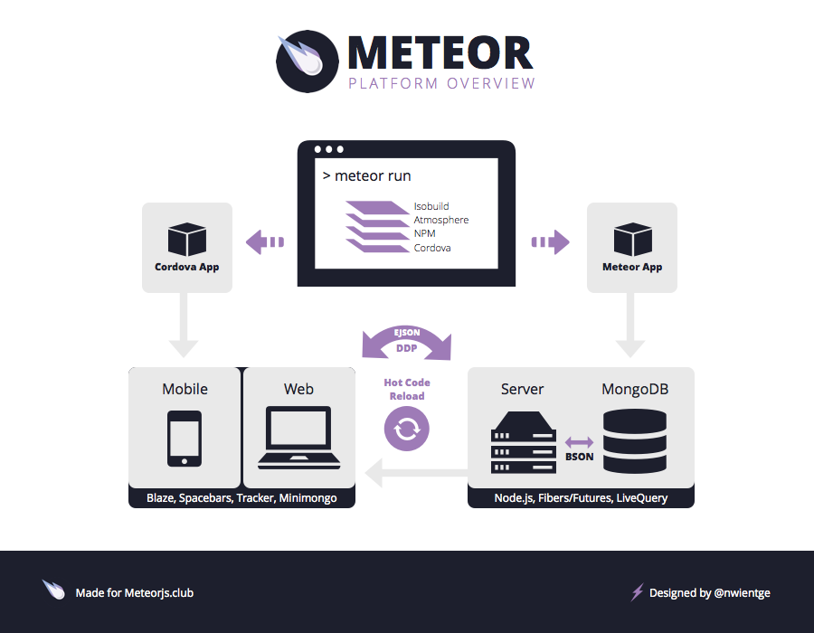
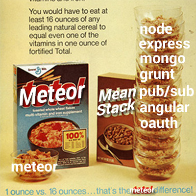

## What is Meteor.js?

Meteor.js is a cohesive development platform, a collection of libraries and packages that are bound together in a tidy way to make web development easier. It builds on ideas from previous frameworks and libraries to offer an easy way to start a prototype app, but it gives you the tools and flexibility to build a full fledged production app. There are libraries like Tracker and Blaze that the Meteor Development Group has built specifically for a reactive front-end experience.

This article is meant to show you what makes up Meteor and what it would take if you went and built your own framework instead.

### Command Line Tool

The command line tool is the glue that creates all of this. The command line tool has everything you need if you want things like Coffeescript or LESS compiler support. It also has the package system built into it:

* [Isobuild](https://www.meteor.com/isobuild) - An isomorphic package system that allows you to easily install packages via Atmosphere, NPM, and Cordova plugins.

### Server

The server is a Node.js app built with certain libraries in place to make the communication happen over DDP and EJSON to the front-end:

* [Node.js](http://nodejs.org/) - A javascript server.
* [Connect](http://stephensugden.com/middleware_guide/) - A library to output http responses from an app
* Database Driver (Mongo) - A simple drive to interface with MongoDB data.
* [Livequery](https://www.meteor.com/livequery) - A library built to query and stream out Mongo data in a reactive way.
* [Fibers/Futures](https://github.com/laverdet/node-fibers) - A wrapper library for Node.js, making it synchronous in an effort to reduce 'callback spaghetti'.

### Communication layer

The communication layer is the real magic that binds the client and server together. EJSON is used to serialize and deserialize data moving across the wire via DDP.

* [DDP (Distributed Data Protocol)](https://www.meteor.com/ddp) - A protocol for sending data over websockets. Dubbed 'REST for websockets'.
* [EJSON](https://www.meteor.com/ejson) - An extension of JSON to support serializing more data types like Dates and Binary.

### Browser

The browser part of the platform is sent over with minimal html and some javascript that loads up the environment. A lot of code is built on jQuery and underscore.js as the foundation. While the server is synchonous, browsers and javascript are asynchonous by nature. Let's look at the libraries that help make up the client and it's reactive nature:

* [Tracker](https://www.meteor.com/tracker) - The backbone of the reactive front-end. It is the reactive 'glue' for any tracker aware libraries you build.
* [Spacebars](https://github.com/meteor/meteor/blob/devel/packages/spacebars/README.md) - A derivation of Handlebars, built to be reactive.
* [Blaze](https://www.meteor.com/blaze) - A reactive library built to marry Tracker & Spacebars up to create live updating user interfaces. Similar to Angular, Backbone, Ember, React, Polymer, or Knockout - just easier.
* [Minimongo](https://www.meteor.com/mini-databases) - A client side mongo library that synchronizes data over DDP and allows the client to reactively consume mongo data.
* [Session](http://docs.meteor.com/#/full/session) - A library to handle reactive UI state variables, nothing like a session in Rails, PHP or Node.js.

### Cordova

The Cordova integration is built into the command line tool and the package system. A simple `meteor add-platform ios` will get you started. The cordova app will be compiled into an app, but the hot code reload will bring over new code and cache it on the local device and load that next time instead.

The Cordova interface is just built upon the same libraries as the browser, listed above.

I cannot begin to comprehend the overall business value of this integration. The ability to build your app for three platforms (web, andriod, iOS) from one codebase will be of immense value to developers and businesses.

### The packages

I mentioned ISOBuild above, but I wanted to reiterate how much power can come from a package you add to Meteor.js. The package system has a few 'core' packages that can easily be added, like `accounts-ui` or `accounts-google`. These packages are little libraries built to take of things like login and authentication, oauth authorization, etc. You also have user created packages on Atmosphere, like `iron:router`, which has become the defacto router for 99% of all Meteor.js apps.

The fact that you can deliver small bits of functionality in a nicely [encapsulated](http://docs.meteor.com/#/full/packagejs) and [automated fashion](http://docs.meteor.com/#/full/meteoradd) brings true power to this platform.

### Why building your own platform is a bad idea

Remember those commercials from the 80's and 90's that would show you how many bowls of cereal you would have to eat to get the same amount of vitamin totals that a bowl of total would give you?

I've had the fortune to watch (via github and conversations) a friend try to build a complete meteor.js replacement with just Node.js and it has given me some deeper insight to what it would take to **not** rely on Meteor.js. Here are some things you would need:

* Node.js
* Express
* Grunt or Gulp
* Mongoose mongo driver
* A pub/sub driver (I hear there is a decent redis one)
* Websocket ([which one?](http://stackoverflow.com/questions/16392260/which-websocket-library-to-use-with-node-js))
* Angular
* Karma
* account/oAuth libraries
* A pot of fresh coffee

On paper that doesn't look so bad, right? I think most people underestimate how much time is spent getting all of the above to play nice in a way that works for your app. 

In my original ["Why Meteor will kill Ruby on Rails"](http://differential.com/blog/meteor-killin-rails) article I talked about how it would take up 12 hours to get an alternative built - I was way off. Anecdotally, it seems to be taking more like 80 hours to get everything hooked up in a functional manner. Those 80 hours don't even account for hitting bugs or weird edgecase interactions, such as the oAuth library not working correctly. We are talking about real measurable value for a startup with limited resources.

### What is Meteor good for?

I had a very interested interaction, with a buddy of mine that uses Rails, the other day. It highlights the common thing I hear about Meteor.js - Meteor is great for Rapid Application Development. He brought up maintainability in the conversation, which most people view as the trade off point between startup speed and speed later in the app development cycle.

> Friend: 'Show me how maintainable a Meteor.js app is over a long period of time'

> Me: 'I've worked on plenty of poorly written rails apps'

> Me: 'Writing maintainable apps is about good practices and standards for people to follow. These things are established through learning, sharing, blogging, etc.'

> Friend: 'Well building a blog in 15 minutes was a cool demo way back when'

> Me: 'Sure, rapid application development feels like a less business value because it has been around for a long time and kind of fallen to the back of the interesting topics around rails'

> Friend: 'yeah, starting fast is not in itself a bad thing. I think I've come to not value it nearly as highly as I used to.'

> Me: 'Fine, stop using ruby on rails, go build something from scratch just using various libraries. See you in 4 weeks :)'

Maintainability is something we should all strive for in our applications, but to be clear I don't think that is a focus on Meteor.js, Ruby on Rails, Ember, etc. Maintainability comes down to strong culture and solid dev practices instilled into the core of your business. Perhaps some of these values can spill out of a framework or a platform, but I think it comes down to the organizational level to implement the right practices in the end. I believe there is strong business value in getting started fast and relying on a cohesive well-tested platform to do it.

### Just getting started

I think the world as a whole is just starting to see the bigger picture in terms of business value that can be derived from Meteor.js. We have already gained a lot just from the 0.9.2 release that integrated Cordova directly into the platform.

I think one of the reasons this platform is so strong and worth learning is the fact that a group of smart people have gathered together to create a company and community that is pushing this technology forward - and with $11 million reasons in the bank, they should have some time to do it!

I am pretty excited to work with this platform every day and can't wait to see what comes down the pipe next.

If you enjoyed this content and want to get started with Meteor.js, be sure to check out my affordable new [8 days of Meteor.js email course](http://8daysofmeteor.com).

Also, I want to give a big thanks to Nick Wientge for making the infographic sexy. Another round of thanks goes to Eric Ripa, Ben Stafford, Mark Shropshire, and Sacha Greif for reading this post and suggesting edits.
