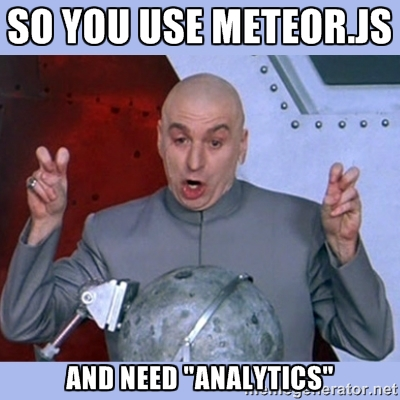
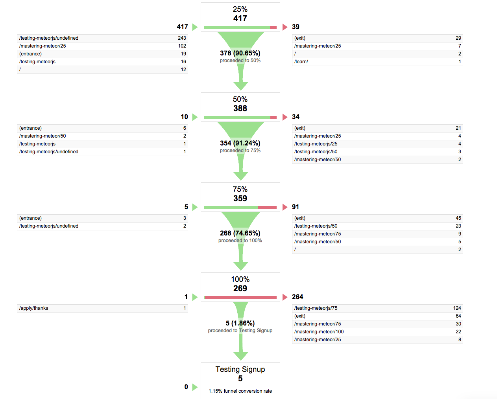

I recently worked on the [Mastering Meteor.js](http://meteorjs.club/learn) page on the [Meteor.js club](http://meteorjs.club) website and realized I needed more information to understand how applications are going and where in the sales process I may need to tweak. Adding analytics and information tracking into your app is a pretty important step, so you can understand how people are using your app.



### Why track events?

When it comes to building an app (web or mobile), you want to make sure people are using the features you put in place. Let's say you add a blank slate design to your event page (for an event collaboration app) and it encourages you to invite others. When you get ready to launch it, it would be a good idea to track events for showing the blank slate and then if they invite people you can track that. By adding these analytics, you can start to gain insight into how often the feature is used. It would probably even be wise to add a button to dismiss the blank slate and track an event when the button is clicked too - then you know the feature is annoying people.

For me, I needed to track how far people were getting down a page by scrolling and then to finally see if they filled out and submitted a form. With multiple steps and a goal at the end, we can create a 'funnel' and see what step people leave the page.

### Setting up the events

The first thing to do is to decide how we want to track our visitor scrolling. I think for the purposes of the Mastering Meteor page, tracking every 25% of the page seems good to me. 

Scrolling a page is a global window event so we need to catch the event a little differently than your normal Meteor event. To get the scroll percentage we need to add scrollTop and the window height together and then divide that by the total document height, then we can multiply by 100 to get our page scroll percentage:

```coffeescript

Meteor.startup ->
  $(window).scroll ->
    windowPosition = $(window).scrollTop() + $(window).height()
    perc = windowPosition / $(document).height() * 100
    if perc > 25 and perc < 50
      Session.set("scrollPercentage", 25)
    if perc > 50 and perc < 75
      Session.set("scrollPercentage", 50)
    if perc > 75 and perc < 99
      Session.set("scrollPercentage", 75)
    if perc > 99
      Session.set("scrollPercentage", 100)
```

If you notice, I want to make this reactive so we can pick up the page scroll on the page in question and fire off the appropriate event. I used a global variable because I want to reuse this page scroll event tracking on multiple pages.

### Firing off the analytics event

Now that we have our Session available, let's setup a [`Tracker.autorun`](http://docs.meteor.com/#/full/tracker_autorun) event to rerun our code any time the scrollPercentage changes, firing off a google analytics event:


```coffeescript

Template.learn.rendered = () ->
  $('input#referrer').val(decodeURI(document.referrer))
  Tracker.autorun ->
    perc = Session.get("scrollPercentage")
    ga('send', 'event', 'Training', 'Scroll', perc)

Template.learn.events
  'submit form': (e, t) ->
    e.preventDefault()
    signupInfo = SimpleForm.processForm(e.target)
    Meteor.call 'apply', signupInfo, () ->
      ga('send', 'event', 'Training', 'Apply', 'Mastering Meteor')
      SimpleForm.resetForm(e.target)
      Router.go('/apply/thanks')
```

Sending the event is pretty easy as you can see, we just call `ga('send')` with the appropriate information and it is passed along. This code will fire off any time the Session variable changes because it is reactive and wrapped up in `Tracker.autorun`.

### Making an actual analytics funnel

Unfortunately, Google analytics doesn't let you create funnel using events, I found this out after the above code was written and deployed. Why do you want a funnel? Take a look at this screenshot:



As you can see we get this really nice graphic that shows 74% of the people get down to bottom of the page, but only 5 actually fill out the form and apply. Armed with this knowledge, I can start exploring ways to increase the form effectiveness now. 

But how do you get that funnel still?!?

Simple, just convert those `ga('send')` calls to be page view calls, like this `ga('send', 'pageview', "/mastering-meteor/#{perc}")`. Now we can add a multi-step goal in Google Analytics and it will give you the nice funnel view you see above. Just know this will inflate your overall 'pageviews' in Google Analytics as well, since we are potentially  firing off 4 pageviews while on one page.

As an exercise for the comments below, any suggestions for what is wrong with the Mastering Meteor page that the funnel just dies at the bottom? Page copy, design, pricing? Something else?
