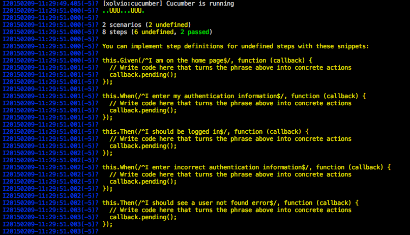
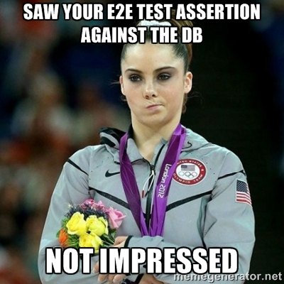

A long long time ago, in a galaxy far far away, there was a young programmer getting started in his professional programming career. If I had access to a Tardis, I would go back and tell that young programmer (me, if that wasn't obvious) the most important things in programming are 1) Continuous Learning and 2) Testing. I remember hearing about the concept of testing and thinking 'What a waste of time, I write extra code to test the regular code I write? Why all the double work?'. It didn't get much better after I ran into my second ever app with a test suite and I did major refactoring and it broke 90% of the test suite - brittle tests can be brutal.


** UPDATE ** This is slightly out of date, be sure to check out this post for something more up to date: http://www.mhurwi.com/a-basic-cucumber-meteor-tutorial/.

## So, why?!?

So, why test? There are many reasons why you want to test, but here are the main two from the developers perspective:

* You want to prevent any regression in your codebase - i.e. Don't let obvious bugs creep in
* You want to improve your code design by thinking about outcomes first - i.e. Write clear and well functioning code

Of course these two reasons easily segue into other ideals like improved confidence in code refactoring, testing provides additional code documentation, and test coverage makes it easier for teammates to jump in and help allowing for team growth and scaling.

## Enter cucumber, stage left

Maybe you have heard of this cucumber testing thingy, maybe not? The idea behind cucumber is that it starts with plain structured english so that non-developer stakeholders can easily get involved with building the test suite. They define a feature and explain what the business value is. Don't take my word for it, go read about [popping the why stack](http://www.antonioyon.com/fantastic-explanation-of-popping-the-why-stac).

The gist is that every feature should boil down to one of these three end goals:

* Protect revenue
* Increase revenue
* Manage cost

Before we write our first feature definition, let's get cucumber installed: `meteor add xolvio:cucumber`. This will add xolvio:webdriver, velocity:core, and velocity:html-reporter to the app so we can execute our tests.

Now we can take a quick look at an example of how to describe a feature in a feature file, let's call it `login.feature`.

```
Feature: Allow users to login and logout

  As a user of the app
  I want to login and logout
  So that I can prove my identity and work with my data
```

Proving your identity and working with stored data your personalized somehow is a way to increase trust and thereby revenue for the company. Still not tracking? Go read the popping the why stack link above again, it goes into detail. The reason why describing the feature in this way is important is that it gives the developer a glimpse into why something is important, and thusly it may change how they implement it. This part of the cucumber is purely for documentation, btw, this isn't run through the [gherkin](https://github.com/cucumber/cucumber/wiki/Gherkin) regex engine.

## Scene two, scenarios

Cucumber is based on a technique called Behavior Driven Development, which is a set of test processed designed to help us understand the behavior involved in our testing. For our Acceptance testing, we want to use steps that use 'Given, When, and Then' as the key starting phrases for each test. Not sure what I mean, go read more [on BDD](http://en.wikipedia.org/wiki/Behavior-driven_development).

Once you have the feature outlined, it is important to understand that each feature contains multiple things we want to test. For example, our feature defines the ability to login and logout, so that provides two scenarios right off the bat. The obvious scenarios are successfully being able to login and logout. But what should the user see when they have an invalid login attempt? Now we start to get into [negative](http://www.aptest.com/glossary.html#negativetesting) and [positive testing](http://www.aptest.com/glossary.html#positivetesting), i.e. testing what should and shouldn't work.

So let's construct a few gherkin scenarios:

```

Feature: Allow users to login and logout

  As a user of the telescope
  I want to login and logout
  So that I can prove my identity and see personalized data

  Background:
    Given I am signed out

  Scenario: A user can login with valid information
    Given I am on the home page
    When I click on sign in link
    And I enter my authentication information
    Then I should be logged in

  Scenario: A user cannot login with bad information
    Given I am on the home page
    When I click on sign in link
    And I enter incorrect authentication information
    Then I should see a user not found error
```

Now once this gets run by velocity, we should see some cucumber info spit out into the logs:



Just copy and paste those steps into a step definition file. I like to keep step definition files named similarly, so let's make a `loginSteps.js` that looks like this:

```
var assert = require('assert');

module.exports = function () {

  var helper = this;

  this.Given(/^I am signed out$/, function (callback) {
    helper.world.browser.
      url(helper.world.cucumber.mirror.rootUrl + "sign-out").
      waitForExist('.account-link', 1000).
      waitForVisible('.account-link', 1000).
      call(callback);
  });

  this.Given(/^I am on the home page$/, function (callback) {
    helper.world.browser.
      url(helper.world.cucumber.mirror.rootUrl).
      call(callback);
  });

  this.When(/^I click on sign in link$/, function (callback) {
    helper.world.browser.
      // saveScreenshot(process.env.PWD + '/auth1.png').
      waitForExist('.sign-up', 7000).
      waitForVisible('.sign-up').
      click('.sign-up').
      call(callback);
  });

  this.When(/^I enter my authentication information$/, function (callback) {
    helper.world.browser.
      setValue('input#at-field-username_and_email', 'joshowens').
      setValue('input#at-field-password', 'good password').
      submitForm('#at-pwd-form').
      call(callback);
  });

  this.When(/^I enter incorrect authentication information$/,
    function (callback) {
      helper.world.browser.
        setValue('input#at-field-username_and_email', 'joshowens').
        setValue('input#at-field-password', 'bad password').
        submitForm('#at-pwd-form').
        call(callback);
    }
  );

  this.Then(/^I should be logged in$/, function (callback) {
    helper.world.browser.
      waitForExist('.user-menu', 7000).
      waitForVisible('.user-menu').
      getText('.user-menu .dropdown-top-level', function (err, username) {
        assert.equal(username[0], 'Josh Owens');
      }).
      call(callback);
  });

  this.Then(/^I should see a user not found error$/, function (callback) {
    helper.world.browser.
      waitForExist('.at-error', 5000).
      waitForVisible('.at-error').
      getText('.at-error', function (err, errorMessage) {
        assert.equal(errorMessage, 'Login forbidden');
      }).
      call(callback);
  });

};


```

The key takeaways from the file above are a few things: we are using webdriver.io when we call helper.world.browser, we can chain actions off one another, we need to wait for elements to exist and/or be visible to the browser because cucumber will move on too fast sometimes, and we need to make sure we call the callback when we are done.

## Ah, caveat emptor... 

What is this Background bit? That is a special before block that runs before all the scenarios in this file. The reason we have it in here is because the current version of PhantomJS uses a shared cookie jar, this is normally good for a web-browser, which leaves us with left over stuff like being logged in if your test logs you in. We are signing out before each test to ensure we start clean each time.

There is fair bit going on in the file above, and since this article is already long, I will leave it as an exercise for the reader to look over the webdriver.io API to figure out some of the calls I am making. I will give you one hint when it comes to forms, make sure you use submitForm('#formId') instead of trying to click('.submit-button') - webdriver doesn't seem to submit the form itself when you just click the button.

## But where is that user data coming from?

So many questions! I kid, I kid. I decided to load the data up using a velocity fixture file. You can put a file anywhere in your test folder and make sure it ends with fixture.js or fixture.coffee and it will be run on the velocity mirror on startup. Here is what the version I wrote for telescope looks like:

```
Meteor.startup(function() {
  if (Meteor.isClient || !process.env.IS_MIRROR) {
    return;
  }
  Meteor.users.remove({});
  Accounts.createUser({
    username: "joshowens",
    email: "josh@test.com",
    password: "good password",
    profile: {
      name: "Josh Owens"
    }
  });
});
```

## That sounds great, but I'm still not convinced

So we've outlined some of the benefits above for testing in general, but I think the best way to write a cucumber test is to think like the user does. In essence we are testing the user experience to make sure it is correct, not just some understand code or calculations like we might with a unit test. Consider this, as I went to add the above tests to Telescope, it turned out that I couldn't get the bad login information test to pass because no error is shown to the user when the click 'sign in' with bad info. That is a bad user experience! Turns out it is a [bug in the useraccounts package](https://github.com/meteor-useraccounts/core/issues/279).




The worst thing you could do in Cucumber test is to check and assert against your database, your user can't really peek under the hood of your application and look at the whole db to find what they need, nor would they want to RIGHT?!? Using Cucumber and asserting on html output makes us think like a user and forces us to make sure we provide the experience they want and deserve.

### Need more?

I recently gave a talk to Meteor Charlotte on this very topic, and I recorded it so you can see me talking about this and doing some live code as well. I hope this helps you get started!

<iframe width="560" height="315" src="https://www.youtube.com/embed/FiClbcyxTGU" frameborder="0" allowfullscreen></iframe>

