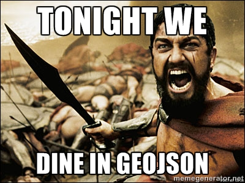
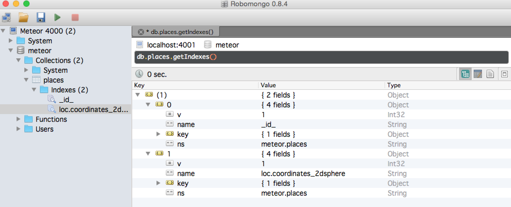

Building a location query for your Meteor app will require a few steps to get going. I hit a few snags along the way when building my example app for my recent [O'Reilly webcast](https://www.youtube.com/watch?v=7iqdkVwtuvg), so I thought I would share some of the important points so maybe someone can avoid my mistakes :)



### Build your index correctly

For me, working with GeoJSON was new, I wasn't familiar with the various structures involved when I got started building my data. Here is what the JSON looks like for GeoJSON in my mongo setup:

```json
{
  "loc": {
    "type" : "Point",
    "coordinates" : [ 
        -84.465176, 
        39.227033
    ]
  }
}
```

The interesting parts to take away here are that we mark it as a point and that the longitude comes BEFORE the latitude, which seemed counter-intuitive to me. Pretty sure we were taught latitude then longitude in the olden days of my schooling.

Now that we have a GeoJSON point saved off in our MongoDB, we can easily add a Mongo 2d index using the the collection _ensureIndex method in Meteor.js:

```javascript
Places._ensureIndex({'loc.coordinates':'2dsphere'});
```



### Query your spatial off

So, we have a shiny new Geospatial index built in our Mongo database now, what do we do with it? Query it, of course! But HOW do we query it?

Simple, just build a $geoWithin query using a $box. In my Cordova example, I used leaflet and the getBounds() call and we will be able to get the bottomLeft and topRight for building our query:

```javascript
Places.find( { loc : { $geoWithin :{ $box : [bottomLeft, topRight]} }})
```

One thing to note, Minimongo doesn't support $geoWithin tag, so it is best to use this query in your server-side publication. In this particular bit of code, we are using the $box shape to run the query, giving it a bottomLeft corner and topRight corner to define the box. The $geoWithin tag also supports $center, $centerSphere, and $polygon.

You can see it all come together in my youtube version of the webcast:

<iframe width="420" height="315" src="https://www.youtube.com/embed/7iqdkVwtuvg" frameborder="0" allowfullscreen></iframe>
