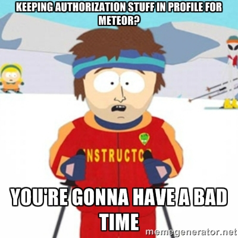

When you get started with Meteor.js, one of the first things you learn about is how easy it is to add user accounts. Something like `meteor add accounts-ui` and `meteor add accounts-password` will get you going. So little effort to gain all that functionality so quickly!



But, there is an odd thing happening under the hood. When you take a look at the data structure that comes along with a user, you will notice a subdocument in the user, a profile object. A profile object that is [completely writeable by default](http://docs.meteor.com/#/full/meteor_users), even after you remove the insecure package. Turns out profiles are designed this way. You can see it in this [commit](https://github.com/meteor/meteor/blob/0e3c992fd8f178efd9e832038257ae36cec90351/packages/accounts-base/accounts_server.js#L1289-L1306), preserved in the code block below:

```
///
/// RESTRICTING WRITES TO USER OBJECTS
///

Meteor.users.allow({
  // clients can modify the profile field of their own document, and
  // nothing else.
  update: function (userId, user, fields, modifier) {
    // make sure it is our record
    if (user._id !== userId)
      return false;

    // user can only modify the 'profile' field. sets to multiple
    // sub-keys (eg profile.foo and profile.bar) are merged into entry
    // in the fields list.
    if (fields.length !== 1 || fields[0] !== 'profile')
      return false;

    return true;
  },
  fetch: ['_id'] // we only look at _id.
});
```
## But wait, why is a writeable profile a bad thing?

Well, let's suppose that you are adding a new feature to determine which Widget Factories a user can see in your app. The easy way is to just add a factoryIds array to your user object. Oh hey, look, there is a profile subdocument, lets just stash the data there maybe? And so maybe in an admin area you do this:

```
newFactoryId = template.$('#newFactoryId').val();
Meteor.users.update(id, {$push: {"profile.factoryIds": newFactoryId}});
```
And the great part is when you call Meteor.user() in the client, the profile is right there with all the factoryIds in it! Perfect, now we can start building our client security (publications) off that, right? WRONG.

Don't do this, because the user can issue their own update from the client and you can't stop them if you left the default settings in:

```
Meteor.users.update(Meteor.userId(), {$push: {"profile.factoryIds": allTheFactoryIds}});
```

If the publication for Factories is setup to push any data for factories in the factoryIds off the user, you are now exposing all that Factory data to a malicious user. Maybe now they have the rights necessary to issue a Factory.stopWork() method and it goes through?!?

## But what can I do about it?

The fix is actually pretty simple, just add a deny rule to the users collection like so:

```
Meteor.users.deny({
  update: function() {
    return true;
  }
});
```

## Thanks, but will this security hole be plugged?

I actually think this security hole will be plugged so new developers don't have to worry about this. Sashko from the Meteor Development Group has proposed to change the way things work. You can read more on the [proposed change by Sashko](https://meteor.hackpad.com/Proposal-for-deprecating-user-profile-3UljX1VayvV).

If you want to learn more stuff about Meteor like this, we cover a lot of these types of topics in my [Mastering Meteor class](https://meteorjs.club/learn) or just join my mailing list and reply to my emails.

I also just soft launched my [8 days of Meteor email course](https://meteorjs.club/8days).
