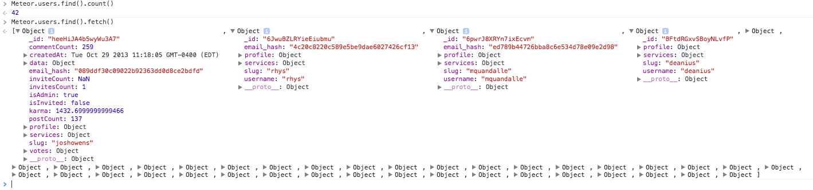

Remember when we talked about some [simple security for Meteor](http://joshowens.me/meteor-security-101/)? Let's continue discussing more advanced topics - we'll call this Meteor Security 201!

Publications are the heart & soul of your application. Consequently, publications are where security can most easily be defeated. Understandably, this may seem strange to people coming from frameworks which don't publish data to the client. The following suggestions come directly from a recent security audit that I conducted for a client.


## Authorization via the router

Iron Router is in almost every app that people create - both mobile and browser versions alike. With Iron Ruoter, you can enforce that users be signed in before they can view certain templates. This is an important feature and you should use it! Showing an 'Unauthorized' template is probably the right thing to do when a user is trying to navigate to a route they shouldn't get to. The key insight is that Iron Router and the templating system are only there to take published data and display it on the screen. Your data is still available via the publication, and Iron Router's primary task is to conditionally render HTML.

Let's talk about a real example so you can see what I mean:

```
// secure page, requires login.
Router.route('/company', {
  waitOn: function() {
    return Meteor.subscribe('companyData', Meteor.userId())
  },
  onBeforeAction: function () {
    if (!Meteor.userId()) {
      this.render('login');
    } else {
      this.next();
    }
  }
});
```

### Not so secure there, onBeforeAction

The above code contains two big flaws. First, the author has assumed that because the `onBeforeAction` never finishes, the subscribe is never called. However, I can open up any Meteor app and call `Meteor.subscribe` right from the console, so you really aren't protected at all. The second flaw is that the subscription returns data based on a `userId` parameter.

Why is the subscription taking a userId a flaw? True security happens on the server. Let's look at why it's an issue and how to fix it.

## Step away from the user input

The truest and straightest path to security in Meteor is to stop trusting your user inputs. In the code above, we passed a userId to the publication and we expected it to return some company data to us. Let's put on our evil hacker hat for a minute and think about what could go wrong. Let's say you also have a publication that exposes a bunch of usernames for some reason. Every object you expose comes with an id on it, that is how DDP handles passing data back and forth.

All a user would have to do is `Meteor.users.find().fetch()` to grab a bunch of ids. Then she could pass each of them to the 'companyData' publication above to expose your secret data!

Look at this example screenshot from a console I ran on crater:



How do we fix that? Let's examine the server-side publication before and after:

```
Meteor.publish('companyData', function(userId) {
  user = Meteor.users.findOne(userId);
  return Companies.find(user.companyId);
});
```

We need to rely on `this.userId` instead of the user inputted id. That would close up the security hole and only expose the data a logged in user should have access to:

```
Meteor.publish('companyData', function() {
  user = Meteor.users.findOne(this.userId);
  return Companies.find(user.companyId);
});
```

I know this may sound made up, but I have seen this stuff time and again in real code. Don't take my word for it - looks like this [Meteor forum post](https://forums.meteor.com/t/handling-rejection-of-subscriptions-return-nothing-or-emit-error/4977) is halfway to having the security hole. Can you spot it?

## Verify your user input

Meteor methods are a perfect way for people to run complex operations or change data. For example, let's say you have the same company data we mentioned above and you want to let users update their company information. You could have a method like this:

```
Meteor.methods({
  'company/update': function(companyId, companyData) {
    Companies.update(companyId, {$set: companyData});
  }
});
```

This may seem okay at first, however we just allowed anyone to update any company with any data. Whoops.


Instead, we should use the `userId` and at least verify that the user has access to that company. You probably want something more like this:

```
Meteor.methods({
  'company/update': function(companyId, companyData) {
    // ensure the inputs are formatted correctly
    check(companyId, String);
    check(companyData, {name: String, location: String, isPrivate: Boolean});

    user = Meteor.users.findOne(this.userId);

    if (user.companyId === companyId) {
      Companies.update(user.companyId, {$set: companyData})
    } else {
      throw(new Meteor.Error(401, "AH AH AH! You didn't say the magic word!"))
    }
  }
});
```

The important point is that your data should be keyed off a user somehow. You should never trust an id being passed in from the client, always use the userId on the server to verify things.

You may also notice we added some `check` calls to make sure we get the `companyData` we expect.

## Allow/deny are only for the client

I haven't run into this one as much, but I figured it is worth saying. Meteor methods modify the underlying database from the server. Allow/deny rules only get applied to calls made by the client. These two concepts don't mix at all. I saw this security hole during a recent review:

```
Companies = new Mongo.Collection('companies');
Companies.allow({
  remove: function(userId, doc) {
    return userId === doc.userId;
  }
});

Meteor.methods({
  'company/remove': function(companyId) {
    Companies.remove(companyId);
  }
});
```

Because the file is shared between the client and the server, perhaps the allow rule would somehow run before the method `company/remove`, only allowing the owner to remove it, right? 

That would be wrong.

What actually happens in this case is that the allow code is never called because the method itself is just a stub on the client. The `Companies.remove` call runs on the server, completely bypassing the allow/deny rules.

Here is the explanation from the [Meteor Docs allow method](http://docs.meteor.com/#/full/allow):

> These checks are run only when a client tries to write to the database directly, for example  by calling update from inside an event handler. Server code is trusted and isn't subject to  allow and deny restrictions. That includes methods that are called with Meteor.call — they   are expected to do their own access checking rather than relying on allow and deny.

## A neat little security bow

In conclusion, I think Meteor is a great platform and like all great platforms, you can do great and terrible things with it... It is all in how you use it :)

* Never trust a user inputted id
* Always find your data off the userId somehow (this.userId in pubs and Meteor.userId() in methods)
* Decide on client side calls or method based data insertion/updates and use the appropriate checks

If you found this helpful, I've also been working on a security checklist that you can print out and keep at your desk. The PDF also has links to great blog articles explaining the different issues each checklist item covers. The way to get the PDF is to join the mailing list using the signup box below. If you are already on the list, you should have it in your inbox already.

Also, big thanks to David Weldon, Sacha Greif, and Sam Hatoum for reviewing my post/code above :)
