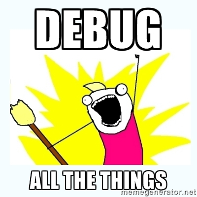
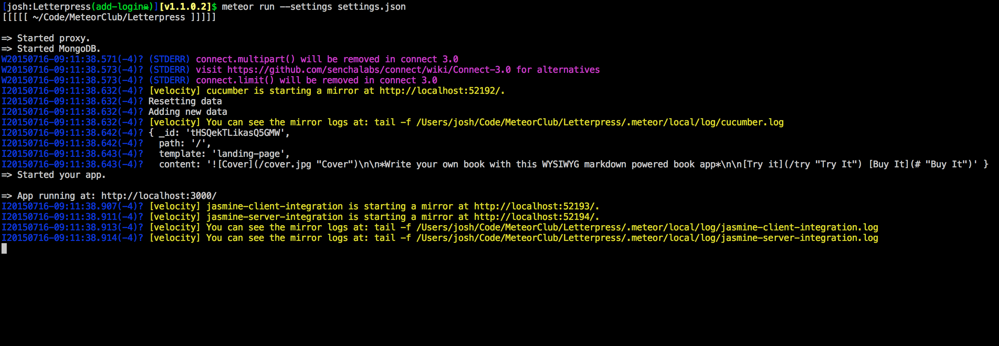
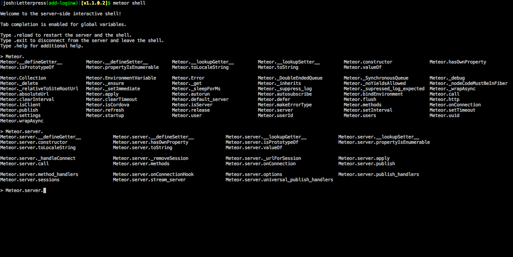
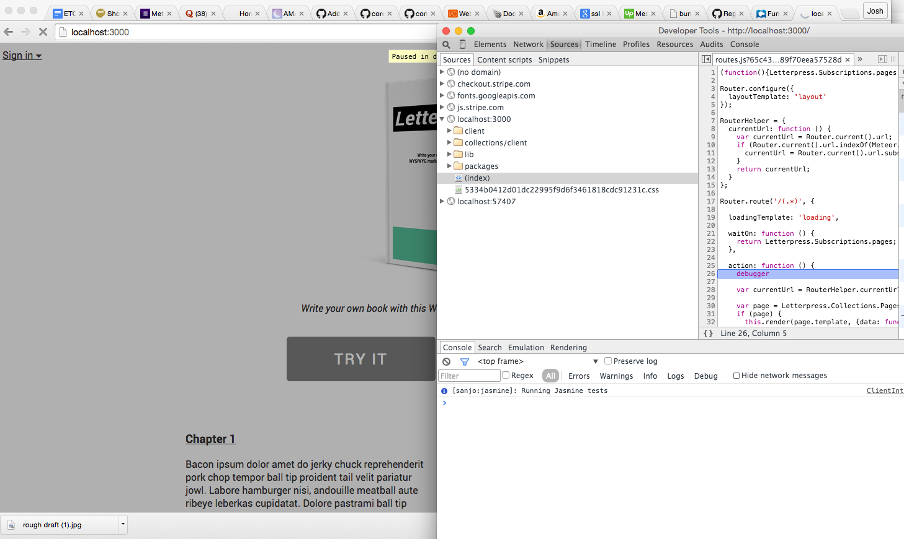
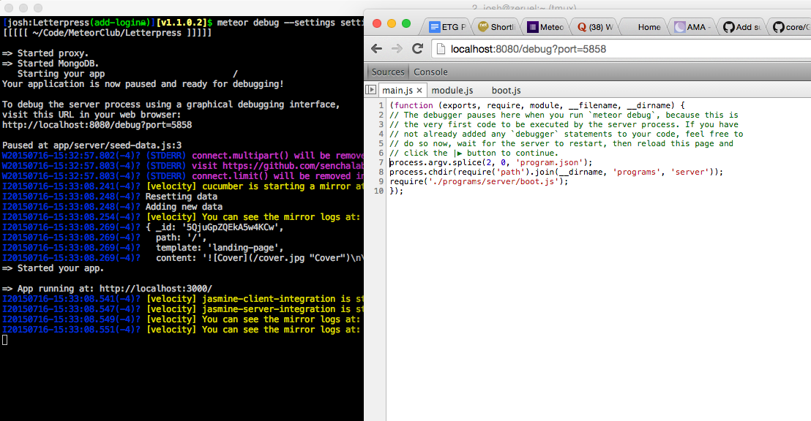
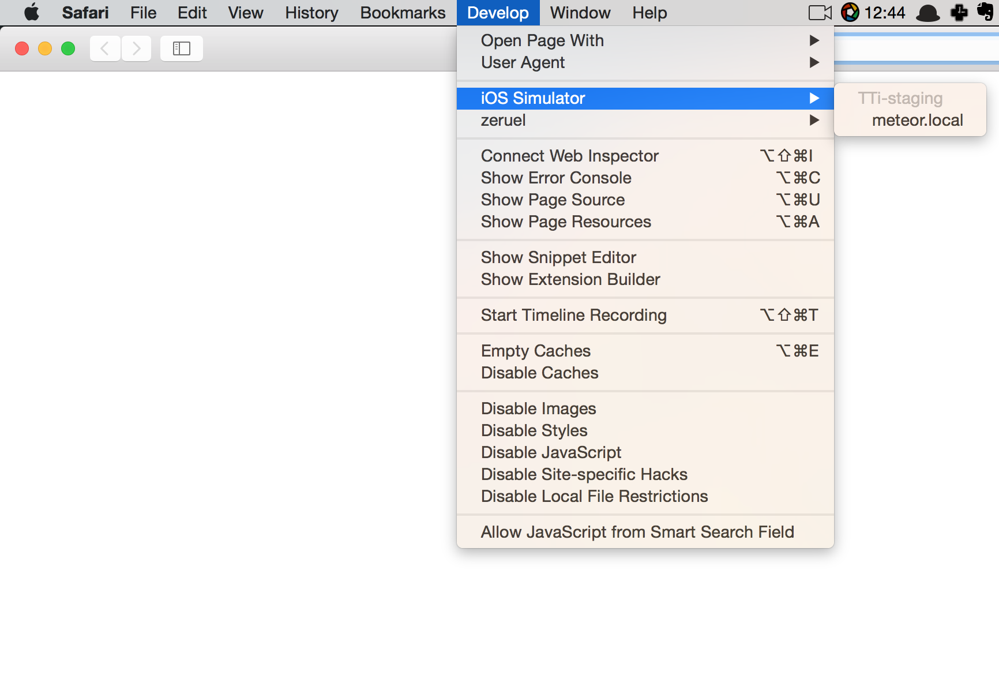

I recently read a post that talked about how Meteor, especially the server side, is hard to debug. I highly disagree with that statement. I actually think debugging is easier than in most languages that I've tried. Since I seem to think it is easy but others don't, it is time for a blog post to share that knowledge!



Let's take a look at all the options we have available to us, there are actually a good number of them:

* `console.log()` (both)
* `meteor shell` (server side)
* Chrome debugger (client side)
* `meteor debug` (server side)
* mobile console (iOS simulator or iOS device)

## The most basic of these options

Every language has a 'print statement' or equivalent. Node.js comes from javascript so we get `console.log`. Console.log works in both the client and server. The call will print a line in the console based on what you give it as a string. In the browser this means the Chrome dev tools console. In the server this means it will print the line out in the running meteor process output. Here is a quick example of how you might use it to inspect the results of an API call:

```
results = HTTP.get("http://api.twitter.com/xyz", {params: {user: userId}});
console.log(results);
// Do other stuff with the results

```

The above code will spit out results into the running meteor log like this screenshot:



Console.log is like the trusty sidekick that you always have to rely on. It is the go to choice for most developers when getting started. It can also feel a little slow because you have to wait for code to run and then adjust it. Let's look at some more interactive options.

## Diving deeper with a REPL

REPL stands for "read-evaluate-print-loop", which is a fancy way to say that it is a shell for a programming language. Think of it as a scratch pad for code you might be working on and you need to see how it will output. With meteor, all you have to do is start a running meteor process. Then open another terminal and type `meteor shell` in the same meteor app. The shell will connect into the running process and start executing any code you type in. As an added bonus, it has autocompletion built in if you hit tab! The Meteor shell gives you access to the running server environment, so you can try out server side code if you need to.



You can also use Chrome dev tools console on the client to work out how code might run or output on the client side too.

I often find this to be a helpful thing when I am trying to work out some bit of underscore.js code. It let's me make sure I am parsing the data structures correctly.

## Debugging in the browser

An interesting thing about Meteor.js and the fact that it is isomorphic, means that we have two environments to debug, client and server. All major browsers come with dev tools built in or you can install some extensions to get dev tools. The javascript console is the most fundamental part of these dev tools. The awesome thing about the browser console is that we can use it to set breakpoints and dive deep into our code.

What is a breakpoint, you ask?

| In software development, a breakpoint is an intentional stopping or pausing place in a program, put in place for debugging purposes. It is also sometimes simply referred to as a pause.

With javascript, we can create our own breakpoint in code using a `debugger` statement. By adding that statement into our client code, the browser console (if open) will catch that and pause the code execution right at the part of code you put the statement in. This means we can stop and dive right into the context of that currently running code. We can look at things like variables and write our own code right in the console. This allows us to easily start tinkering and learning why our code isn't working.

Using `debugger` is very powerful and can help you find the bug in the code you are writing. You can also go to the sources tab in Chrome and find the line of code and click the line number next to it to add a manual breakpoint.



## Debugging in the server

Right before Meteor 1.0 came out, we got an interesting new feature snuck in by *[MDG]: Meteor Development Group, `meteor debug`. Use `meteor debug` instead of `meteor run` to start your meteor application. It will add the node inspector package to your running Meteor app so that you can debug it.



Node inspector works by hooking into your running Meteor server. The inspector has a web interface that looks a whole lot like the Chrome dev tools console. When you connect to the web interface, it also acts like the Chrome console. We can add a `debugger` statement so the web interface will pause execution. We can then start diving into the breakpoint with our context available.

## Debugging in the phone environment

Having spent the last few months working on a Meteor Cordova mobile application, I can tell you that it was painful to live without a debugger in the phone environment. At least until I found out that you can easily attach a Safari browser console to your running iOS simulator or tethered iOS device!

All you have to do is start up the iOS simulator or connect a running iOS device via USB and open up Safari. You can then go to the `develop` menu and should see either the iOS Simulator or device listed. You can hover over the correct option and should see a list of applications that you can connect to for debugging. Just click your Cordova application and it will open up a Safari console. This will allow you to set breakpoints, try out code, etc.



You can also do a similar [debugging process with an Android phone using Chrome](https://developer.chrome.com/devtools/docs/remote-debugging).

## Developer skills

So we have covered a lot of options to help you dive in and debug your code. I think this is essential thing to learn and understand if you want to be a productive developer. It is also vital that a developer use something like Google to research and learn answers to questions. I googled "meteor debug" and the second hit links to [this stackoverflow post](http://stackoverflow.com/questions/11034941/meteor-debug-on-server-side). That stackoverflow post has been updated to show exactly how to handle `meteor debug`.  Perhaps some version of this blog post is missing or lacking in the Meteor documentation - but google can still get you the answer you seek when the Meteor docs don't have it. Google before you [complain about the platform being broken](https://medium.com/@llaine/meteor-the-dark-side-of-the-moon-f885d8fdbf6a).
