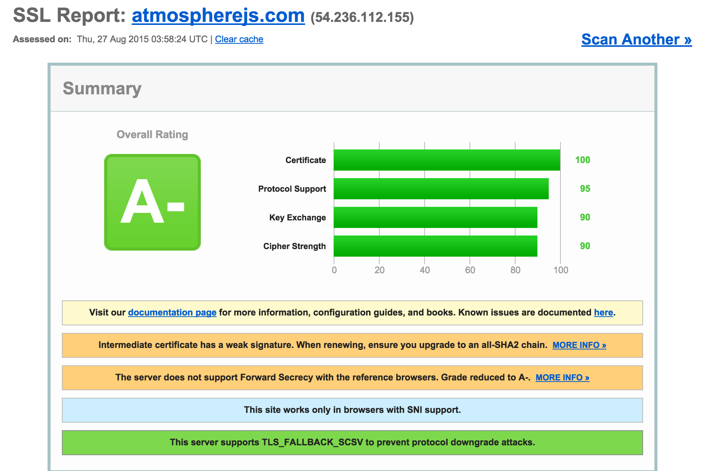

I had an interesting question the other day about Crater.io - 'What is the point of adding SSL to Crater, isn't all that data public and not sensitive?'. I realized that I've never seen anyone talk much about SSL and why you should use it with your Meteor apps. Let's dive into Meteor and SSL!

> EDIT: I've edited the article to reflect using Nginx to redirect as many report circular loops with the force-SSL package because we terminate SSL at the proxy level. I also added a link to a great walk-through on adding SSL certs via Let's Encrypt.


## Why SSL?

SSL, or TLS as the more modern version browsers use, is a guaranteed contract between you and the server that you are connecting to. A third party (Certificate Authorities or CA) handles ensuring security certificates are issued to domain owners. These trusted certificates are used by your browser to create a key to encrypt and decrypt the connection on both ends. A site with SSL setup provides many benefits to both the user and the website owner:

* Ensuring domain identity and creating trust that you have connected to the right server
* Prevents snooping of data being passed back & forth
* Gives you a slight boost with your Google SEO efforts, Google values SSL sites more

Here is an example of an SSL handshake between the browser and a server. The process uses TLS to create an encrypted tunnel for your data:


## Nginx to host SSL certs & proxy to Meteor

Node was actually pretty [notorious at handling SSL](https://jimbesser.wordpress.com/2014/08/13/efficient-load-balancing-and-ssl-termination-for-websockets-and-node-js/), so it may be best left to other options for handling the certificate and handshakes between browser and server. Your options here are to put a server such as HAProxy, Stud, or Nginx to serve up the SSL cert. The front-end proxy can pass the request to your running meteor app. My recommendation is to do proxy on the same server or over a private network link. Then block the Meteor app from getting direct requests via a firewall.

The rest of this article will assume you already have your SSL certs. If you don't already, I would highly recommend [following this post to get them from Let's Encrypt](https://www.digitalocean.com/community/tutorials/how-to-secure-nginx-with-let-s-encrypt-on-ubuntu-14-04)!

Here is an example of the Crater.io Nginx SSL settings:

```
upstream crater {
    server 127.0.0.1:3000;
}

server {
    listen 443 ssl spdy;
    server_name crater.io;
    access_log /var/log/nginx/crater.access;

    ssl on;
    ssl_certificate ssl/crater_bundle.crt;
    ssl_certificate_key ssl/crater.io.key;
    ssl_session_cache shared:SSL:10m;
    ssl_session_timeout 10m;
    ssl_ciphers ECDH+AESGCM:ECDH+AES256:ECDH+AES128:DES-CBC3-SHA:!ADH:!AECDH:!MD5;
    ssl_protocols TLSv1 TLSv1.1 TLSv1.2;
    ssl_prefer_server_ciphers on;
    ssl_session_cache shared:SSL:10m;
    add_header Strict-Transport-Security "max-age=63072000";
    add_header X-Frame-Options DENY;
    add_header X-Content-Type-Options nosniff;
    ssl_stapling on;
    ssl_stapling_verify on;
    resolver 8.8.8.8 8.8.4.4;
    
    location / {
        proxy_pass http://crater/;
        proxy_http_version 1.1;
        proxy_set_header Upgrade $http_upgrade;
        proxy_set_header Connection "upgrade";
        proxy_set_header Host $http_host;

        proxy_set_header X-Real-IP $remote_addr;
        proxy_set_header X-Forwarded-For $proxy_add_x_forwarded_for;
        proxy_set_header X-Forward-Proto http;
        proxy_set_header X-Nginx-Proxy true;

        proxy_redirect off;
    }
}
    
```

## ~~Force-SSL~~ Force them over SSL

Luckily, once you get a proxy server setup with SSL, you can ~~install a core Meteor package called Force-ssl~~ add a quick config to direct users from port 80 to port 443:

```
server {
    listen 0.0.0.0:80;
    server_name crater.io;
    return 301 https://$server_name$request_uri;
}
```

Since a Meteor app is a tiny amount of html served up with javascript and css files attached. The majority of your site will be inflated and constructed from data transferred via DDP. If that data is flowing from the server to the client in plaintext, it might be easy to snoop on that data. By force redirecting over SSL, you make it much harder for others to snoop and read that DDP/websocket data. Don't take my word for it, check out [how Pete Corey hacked away at Meteor by sniffing DDP data](http://blog.east5th.co/2015/08/23/hijacking-meteor-accounts-by-sniffing-ddp/).

## Man in the Middle attacks?

Still not convinced that you need SSL for your Meteor.js application? Here is a good scenario to outline why SSL is important. Have you ever gone to a coffeeshop? Gotten on public/unfamiliar wifi, perhaps?

This is a great way to have a MITM (man in the middle) attack perpetrated on you. You connect to that unknown wifi and it starts routing traffic for you. Little do you know, that traffic is being sniffed and replaced with hacked versions. When your connection to a site is in plain text, it is a very easy thing to sniff out. Then the hacker can serve up fake or hacked websites, doing things like grabbing your username/password. You certainly have options like a VPN to help you out with this type of issue. Forcing SSL connections for web apps is your best bet to ensure things are secure.

The option for the Strict-Transport-Security header is a good setting to turn on to combat this issue. It will tell the browser that any future visit to this site should be sent over HTTPS and never unencrypted. 

You also need to be careful about which protocols and ciphers you support, you can use this [site to test out your running SSL config](https://www.ssllabs.com/ssltest). Be sure to keep up on your site score! I found I had a weak cipher and I only got a B on the site, when I previous had an A+ a few months back. Here you can see a comparison of Crater and Atmosphere SSL scores:




## Wrapping up with SSL

Remember that person that asked about using SSL for Crater.io? The reason I set it up is because I don't want anyone hijacking your data being passed back and forth. Nor do I want someone pretending to be Crater while you are putting in password information. I care about you Meteor fans and certainly don't want to expose anyone to malicious hacking ;)
