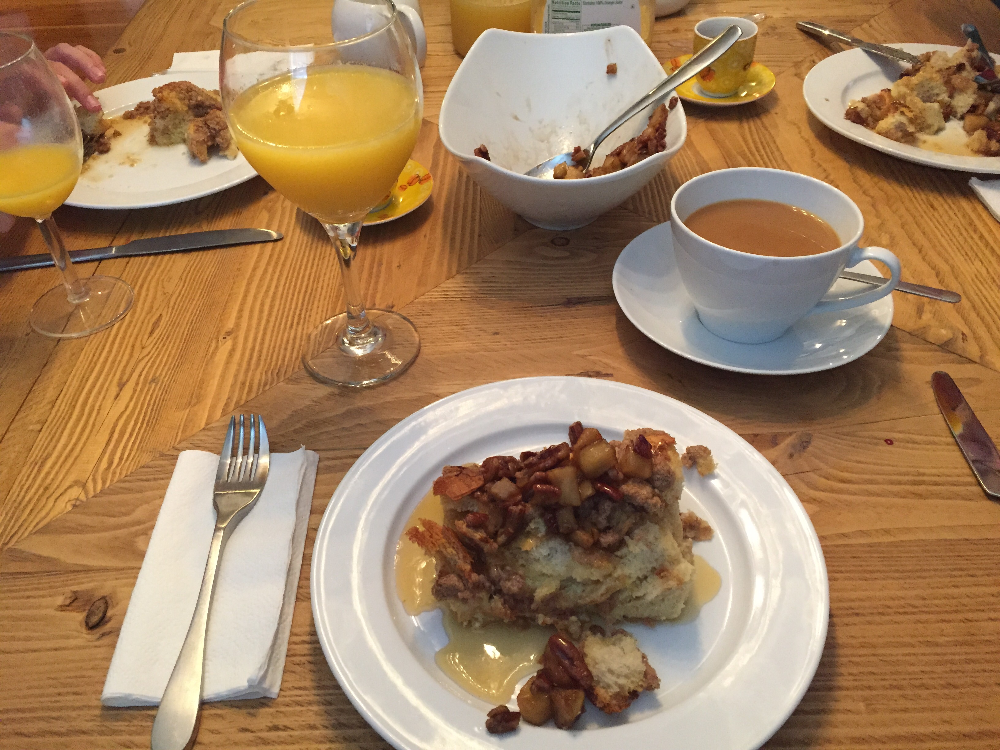

Maybe you've seen recently that I decided to throw a [Meteor conference](http://meteorspace.camp)... I've received a few questions about it, so I thought it would be good to address some of those.

## Conferences ignite communities

My biggest reason for wanting to see a conference thrown is it stokes a fire in the community around it. Thinking back to my 10 years in the Rails community, I remember the excitement and passion that comes from seeing old friends, making new friends, and hearing about exciting things happening in the community. I know, I know, this sounds all touchy-feely, right? What if I had a measurement for you?

Look at that graph, it is a measurement of search traffic using Google trends, for the keyword 'React.js'. Notice the spike that happened in February 2015? They had a React conference on January 28th and 29th! Perhaps it is a coincidence, but I tend to think that isn't the case. React started popping up more on my radar around the same time.

## Why not throw something bigger or more central?

Ok, so after about 3 weeks of tickets being on sale, the tickets are a little over 60% gone. I've started to get questions from some people about 'Why not make it bigger?' and I think it is a fair question. My original plan was to launch a Meteor Conference in San Francisco and open it up to 200 or so people to come and have a great milt-day conference. After a few phone calls with facilities and a few phone calls with the Meteor Development Group (MDG), I decided it would be best to let MDG sort out an event like that. So, where did that leave me? I still wanted to host something, but I wanted it to be smaller and more personal. Perhaps a place that isn't just the San Francisco tech scene...

Perhaps this sounds silly, but I started thinking back to the company retreats that I've been on and how energizing those could be. After brainstorming with my wife, we came up with the idea for throwing an event in an amazingly large cabin located within the Smoky Mountains. We set out to find one of the largest cabins we could and started running numbers to see if we could make it work. With the help of some amazing sponsors like [Modulus](https://modulus.io/) and [OKGrow](http://www.okgrow.com/) the event became doable and thus.... we have the birth of [Meteor Space Camp](http://meteorspace.camp).

## The key to a good conference

Another reason to keep the conference a bit smaller to start out is because it makes it a bit easier to manage. I personally think there are three keys to running a good conference:

1. Solid talks from awesome people
2. Delicious food that people don't forget
3. A great experience

When we started talking about throwing this, my wife immediately volunteered her amazing cooking skills up to cater the entire weekend event! She has some amazing things planned, I am pretty excited for it! Check out this french toast cassorole we tested out this weekend as a potential dish at the event...

As for the talks, I can promise you that we already have a stellar cast of people coming to the event and they all want to give talks.

Both points 1 & 2 combine to form the third point. Even if you don't come and give a talk, the chance to meet all the people that are invested in Meteor by doing some type of full-time work with it is of immense value!

## Don't miss out

Like I mentioned before, we have a few tickets left, but don't miss out on your chance to come spend the weekend diving deeper into the Meteor Community. Where else can you [hang out with people](http://meteorspace.camp) like Charlie Key, Paul Dowman, Pete Corey, Ben Strahan, Katie Reed, Dean Radcliffe, and myself?

