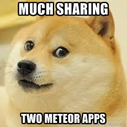
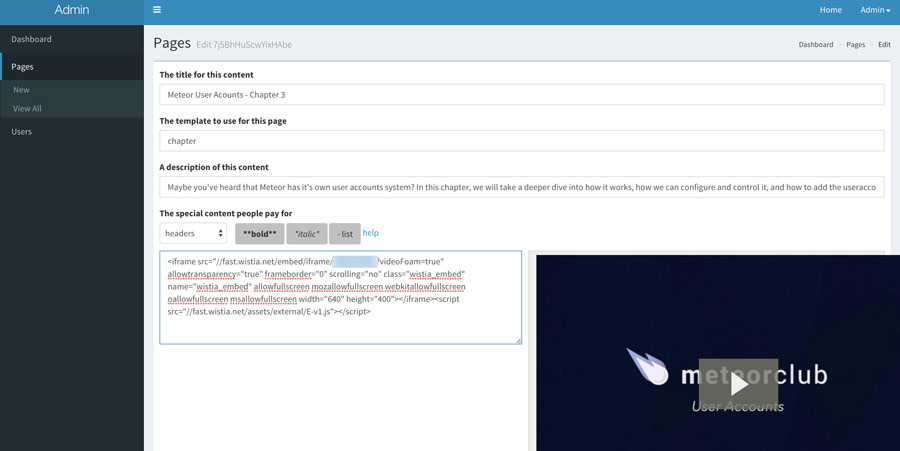

I recently launched my [Mastering Meteor.js video course](https://mastering.meteorjs.club/), and the site is using a [platform that Sam Hatoum and I recently rebuilt](https://github.com/xolvio/Letterpress) (mostly Sam, haha). Our focus was building a well-tested Meteor application that is an open-sourced learning tool for Meteor fans. The open-sourced app is also used to drive the Testing Meteor videos we are launching soon. We chose to focus on core functionality around purchasing and consuming content and come back to features like an admin panel, later. In hindsight, we should have spent a little time on an admin interface because the app is a CMS with stripe e-commerce built into it for selling books and videos. You need an admin interface to add/remove pages! The lack of an admin panel left me with a choice to either use compose.io to input data, spend time writing a complete admin interface in the app, or creating a new easily deployed microservice app.



## Why a microservice?

I realize that 'microservice' is a buzzword, but I've been doing a lot of thinking about how Meteor itself is architected and how you get advantages when building microservices. So what are some properties of a microservice? Here is the [definition from Wikipedia](https://en.wikipedia.org/wiki/Microservices):

* The services are easy to replace
* Services are organized around capabilities, e.g. user interface front-end, recommendation, logistics, billing, etc
* Services can be implemented using different programming languages, databases, hardware and software environment, depending on what fits best
* Architectures are symmetrical rather than hierarchical (producer - consumer)

There are many different ways to build a microservice with Meteor. The overall architecture of a Meteor app gives us a few different ways to approach this issue. We could create a second backend Meteor app and connect from the front-end using DDP. While we could make this work, I think creating a communication layer between two apps sounds like overkill for our goals. Instead, we can let the two apps share one database, and they can both work with the same data. This share database pattern will allow us to create and view the content that powers the e-commerce site from the admin app.

## How do you build the microservice?

Since we are building two apps that share the same database, we can just build the admin app like normal and then set the `MONGO_URL` to point to the main application database. Because the microservice frees us to make choices just for the admin app, we can use a couple packages that don't exist in the main app:

1. yogiben:admin
2. useraccounts:bootstrap & accounts-password
3. aldeed:autoform & aldeed:simple-schema
4. q42:autoform-markdown

I created one basic `lib/accounts.js` that is a standard useraccounts config and `lib/collection.js` so that I could control what and how the CMS page input worked:

```
Schemas = {};

Pages = new Mongo.Collection('pages');

Schemas.Pages = new SimpleSchema({
  title: {
    type: String,
    label: "The title for this content"
  },
  template: {
    type: String,
    label: "The template to use for this page"
  },
  description: {
    type: String,
    label: "A description of this content"
  },
  premiumContent: {
    type: String,
    label: "The special content people pay for",
    autoform: {
      type: 'markdown'
    }
  },
  order: {
    type: Number,
    label: "Order to show on ToC"
  },
  path: {
    type: String,
    label: "Url path"
  }
});

Pages.attachSchema(Schemas.Pages);
```

The usage of q42:autoform-markdown means we get a nice way to see what the rendered output looks like in the admin app. We can add one last config to make sure `yogiben:admin` picks up our collection and we can mark which user emails have admin control:

```
AdminConfig = {
  adminEmails: ['joshua.owens@gmail.com'],
  collections:
  {
    Pages: {}
  }
};
```
Now all we have to do is deploy the app. I used MUP to deploy both apps on the same box, having the main app run on port 80 and the admin app on port 8000. The only trick it to set the admin app not to install Mongo and then set the `"MONGO_URL": "mongodb://127.0.0.1/meteor"`. Then just `mup deploy` once the setup finishes.

## Tying it all together

Now that deployment is complete, and you can log in, you can start creating pages for the Letterpress app. Here is an example of what it the admin interface renders: 



We get other side benefits of this setup as well. Our front-end app has no logic around 'admins', how they are, or why they even matter - that is all contained in our admin app itself. We also get to use pre-canned packages that rely on bootstrap; there is no need for us to mess with a UI at all. The build for the admin app only houses assets needed for the admin app that cuts down on overall app sizes for both apps.
