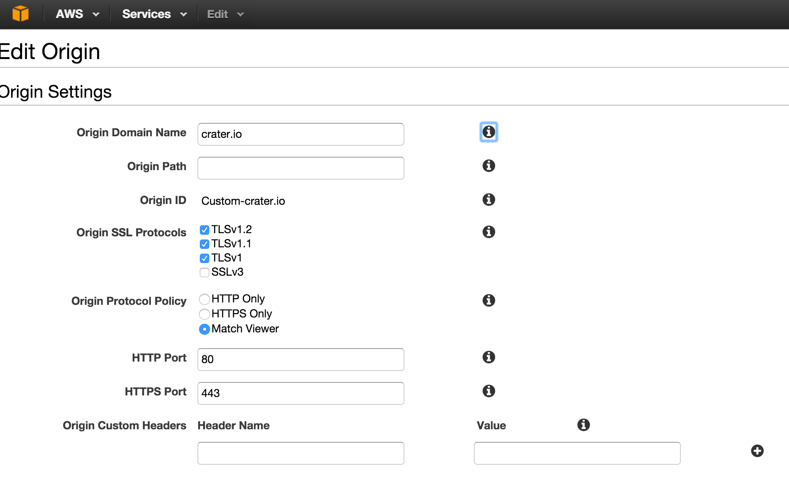
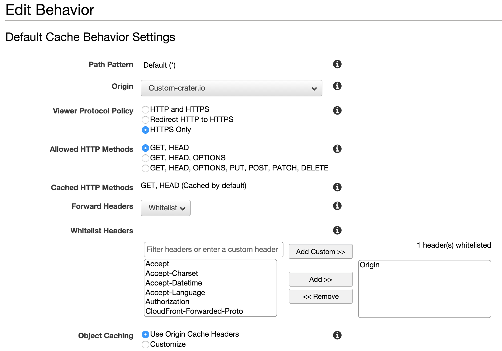

What if you could make your Meteor application **super fast for anyone, anywhere** across the globe? A Content Delivery Network is just the thing to help with that.

I've seen a few articles on using CloudFlare as a CDN with Meteor, but I just needed the CDN to speed up file delivery. CloudFlare was major overkill for just increasing file delivery speed, plus it comes with the downside of having to turn off WebSocket for DDP. **CloudFront** sounded much more appealing to me with its flexible Custom Origin support. The idea of a Content Delivery Network is to have multiple endpoints that have the smarts to figure out where your browser is and to deliver the files to you from the closest possible endpoint on the network. If you think of how a network works, we are trying to reduce the number of 'hops' or middle points that a request/response has to go through. Fewer stops in the network path mean people in Denmark, India, or China should get the files just as fast as people get them in New York.


## Setting up CloudFront

CloudFront is a fantastic CDN option that is offered by Amazon as part of their Amazon Web Services. The great thing about CloudFront is that they have 'origin' support, which is a fancy way of saying you don't have to upload files to a CDN server ahead of time. You make a request like `https://d1477spkfkmftw.cloudfront.net/58ebd8cfe870de43c57d284eead67308f6722e32.css` and if CloudFront doesn't have the file already it will go back to the 'origin' that you set and grab it, so it will go to `https://crater.io/58ebd8cfe870de43c57d284eead67308f6722e32.css` and grab the source file and put it up onto their CDN network. A Custom Origin is an excellent way to get a CDN working because Meteor already has a cache busting system. The way meteor name files during the build process, like the CSS file mentioned before, using an MD5 hash fingerprint that gives you a unique file name for each deploy.

Setting up your custom origin domain is pretty easy. I've included a screenshot below of the settings I used for [Crater](https://crater.io). 



One other thing to be careful with is font files being served up by the CDN if you are using a custom font file and Meteor serves it up for you then the CDN URL will get in front of the static asset, and it will cause Cross Origin Policy issues with browsers like Chrome. I ended up having to whitelist the Origin header and put in a custom snippet in my Nginx setup so that I could specify the Origin to be open for font files like so:

```
    location ~* \.(eot|ttf|woff)$ {
        root /opt/crater/app/programs/web.browser;
        access_log off;
        add_header Access-Control-Allow-Origin *;
        add_header Vary Origin;
        add_header Pragma public;
        add_header Cache-Control "public";
        expires max;
    }
```



## Setting up Meteor to use CloudFront

Honestly, this was probably the trickiest part to figure out **how**, but easy to implement once I found the way. Big thanks to Dean Radcliffe for helping me find it. There is a little gem of a method (from Emily Stark) that came out as part of [0.7.0 version of Meteor](https://github.com/meteor/meteor/commit/6eccf8cbbb074bd750851a3f75595011aa7533ed). It allows you to set `WebAppInternals.setBundledJsCssPrefix()` with a URL such as our CloudFront URL, and it will prepend that on to any assets we try to load such as CSS, JS, and Images for our Meteor app. You just need to call the setBundleJsCssPrefix on the server at startup time.

I made a server/cdn.js file and put this code in it:

```` js
Meteor.startup(function(){
  WebAppInternals.setBundledJsCssPrefix(Meteor.settings.cdnPrefix);
});
````

I am using a Meteor.settings call here to allow me to easily configure a cdnPrefix option per hosting environment, we don't want to potentially poison our CDN cache with new files you might need for staging and have those end up showing up in our production app.


## Why this all matters

I talked earlier about a Content Delivery Network can help deliver your content faster, but there are other reasons to use a CDN. Most people don't realize this, but browsers limit the number of connections it will open to any domain at a given time. While this is configurable for some browsers, it is safe to assume that most don't tweak this setting. If the clients browser limits to 2 connections at a time and they go to load up Crater.io, they need to fetch the HTML, CSS, Javascript, and then load up a web socket connection once it starts to run the Meteor app startup process. Now toss in the fact that we have multiple assets like font files, images, etc. Loading 10 files two at a time can slow down the rendering of a page. By using a CDN, we now move some of the files off to a new domain and get 2x the number of connections for the same set of files now... Our Meteor app only has to worry about serving up the HTML and web socket connection; the CDN will deliver the other static files in a much faster manner.
