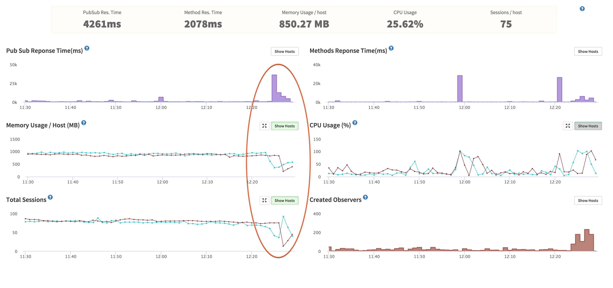

So you want to build your own Meteor hosting setup, eh? Let me just start off by saying this is probably a bad idea. I recently wrote about how it shouldn't matter to you if Meteor scales to a million people or not because you should spend your time on finding a good product/market fit first. Similarly, you shouldn't spend time on DevOps to save $15-$30 a month on hosting costs, because your time is worth money and you should spend that time/money on finding that product/market fit. I love DevOps and [Digital Ocean](https://m.do.co/c/2fb9d926fd4b) (get a $10 credit with that link), so I built the extensive hosting setup as a learning process. I thought maybe if I shared my experience and configs, it might help save you some time and headache too.


This article covers:

* Deploying to multiple servers with Meteor Up
* Load balancing with Nginx and sticky sessions
* Doing out of band health checks with our proxy
* Setting up Meteor to work with IP Addresses and our proxy config

Things you should go read more about to get the whole picture below:

* [Setting up SSL with Nginx](http://joshowens.me/ssl-and-meteor-js/)
* [Adding a CDN setup to your Meteor app](http://joshowens.me/using-a-cdn-with-your-production-meteor-app/)
* [Getting a basic Meteor Up deploy working](https://github.com/arunoda/meteor-up)
* [Lower your CPU usage by switching to Oplog Tailing with Meteor](https://themeteorchef.com/snippets/setting-up-mongodb-oplog-tailing/)


Let's see what our structure will look like after we finish the above articles and this tutorial:


## The challenge of scaling Meteor

Meteor is very fun to build an app with because it has great real-time data synchronization support built into how it works at the core, called DDP. While the dev process can be fun and makes for great demos, it can also be a challenge to wrap your mind around how it operates and how to optimize for those operations. The key problem here is that every query sent to a server is tracked and checked for updates in some way, generally via Poll & Diff or Oplog Tailing. Either way, getting a new publication still requests you to take the request, find the data, and return the data to the browser. The initial find and return process costs CPU and Memory resources. Tracking changes continue to require that memory and occasional CPU consumption.

The challenge here is that since each app server tracks the queries, it cares about for connected users, you want to make sure that user stays connected to the same server as much as they possibly can. That ensures you only load the data and consume memory for that user once. A lot of times you will see this referred to as Meteor needing 'sticky sessions' to work properly. The sticky session problem is most noticeable when you do a deploy of your Meteor app (to multiple servers one at a time), you can see a massive influx of connected clients hitting the second server while the first restarts. It causes a lot of browsers to basically login again and pull all their subscriptions back in, putting a huge strain on both the running app server and the mongo server.



Let's build the basic running Meteor app; then we can walk through scaling it with Nginx and sticky session support.

## Building the basic Meteor app

The basis of our hosting setup is using Meteor Up (Mup for short), and there are [plenty of articles](http://meteortips.com/deployment-tutorial/digitalocean-part-1/) that explain how to get up and running with Mup. The idea here is that you can build one Droplet using Mup to setup and deploy to it, then you can shut it down and take a snapshot. The snapshot will allow you to start quickly new servers from that image; you can also use nightly backups when needed. See the screenshot get an idea of how that works:


Now, if you setup Mup right, we should have a server running on port 80 of our [Digital Ocean droplet](https://m.do.co/c/2fb9d926fd4b). After the snapshot or backup restore, we should have two servers running our Meteor app, connected to the same database. We just need to edit the mup.json to have an array of servers in it.

```
  // Server authentication info (this uses ssh keys via ssh-agent)
  "servers": [
    {
      "host": "45.55.193.211",
      "username": "root"
    },
    {
      "host": "104.131.176.36",
      "username": "root"
    }
  ],
```

Mup deploys the code to one server at a time from the array we give it. That means you will get zero downtime deployments for free if you use MUP to do the deploy to your multiple servers. Our Nginx load balancing configuration will make sure people reconnect to a running server when a deploying server goes offline. Keep in mind, you will degrade your service like the screenshot above showing the large influx of users after a server goes down. Mup deploys code by creating a bundle and sending that bundle up to each server. The Mup deploy process even makes it easy to add new servers, just do another creation from a backup on Digital Ocean and add the server to your array, then just do a quick deploy to get the new droplet up to date.

## Harnessing more than one running Meteor app

Remember when I mentioned we needed sticky session support? Supporting sticky sessions is where things got a little more interesting and time-consuming. There are a few options available, such as HAProxy or Nginx for making Load Balancing requests across two or more servers. HAProxy has been around longer, but I feel like you can do more in general with Nginx. On top of that, I felt more comfortable setting up Nginx for SSL. The one downside of Nginx as a proxy server is that it does in-band health checking. That is a fancy way of saying it doesn't know a backend app server is down until it gets a 500 back or the request times out. Obviously, this isn't the type of experience I want to give the users of Crater, so I opted to dig deeper and try to add the [Upstream Module](https://github.com/yaoweibin/nginx_upstream_check_module) to Nginx. The module will extend Nginx to support out-of-band health checks to the backend servers; that means Nginx should be able to learn about a downed backend server before it even tries to send a user to the app server. Luckily I found this great article that [walks you through setting up Ubuntu to custom compile a Debian package](https://serversforhackers.com/compiling-third-party-modules-into-nginx) that you can install and still get all the great upstart scripts that Ubuntu uses. Add another new droplet to your Digital Ocean account. A $5 droplet should be okay for a load balancer. Now get Nginx compiled and installed with the above tutorial.

Now that we have compiled, and Nginx is running, we need to get it configured to work properly as an out-of-band proxy with sticky sessions setup. The great part is, sticky sessions are super easy to setup with Nginx, it is just one line of configuration! Let's set up our upstream config:

```
upstream crater {
    ip_hash;

    server 10.0.1.73:80;
    server 10.0.1.151:80;
}
```

The `ip_hash` line is the magic that gets us sticky sessions for Meteor. We are telling Nginx to run a particular method against the client's IP address to determine which server they get forwarded to. If the server they are on goes down, they will re-request and get sent to the server that is up. Once they original server comes up, they should switch back at some point - WebSockets are long-lived, so it doesn't always happen right away.

> If you are paying attention, I am also using the private networking feature of Digital Ocean to pass all the load balancer traffic to the private IP addresses of our Meteor app droplets.

The next step is to get our upstream module working:

```
upstream crater {
    ip_hash;

    server 10.0.1.73:80;
    server 10.0.1.151:80;
    check interval=750 rise=2 fall=2 timeout=1000 type=http;
}
```

The `check` line is what configures the Upstream module. We tell it to check every 750ms and to mark it up or down after it sees it up or down for two checks in a row. The timeout is set to 1000ms, and we are doing an HTTP check. If my math is correct, that means we should only wait for a max of 1750ms before a server would be marked as down for timing out two checks.

Let's add the SSL support...

## Setting up SSL on your Nginx load balancer

We will configure the server to redirect requests on port 80 to the site on port 443 (SSL):

```
server {
    listen 0.0.0.0:80;
    server_name crater.io;
    return 301 https://$server_name$request_uri;
}
```

I use this now instead of force-SSL because we want to force our users into SSL before they ever hit the Meteor app. Force-SSL also wouldn't work because we are hitting port 80 for our backend Meteor apps, the SSL terminates at the load balancer. You can read my other article if you need to get [more on SSL + Meteor](http://joshowens.me/ssl-and-meteor-js/). The key thing we want to add to the server block for our app is the /check-status URL support:

```
server {
    listen 443 ssl spdy;
    [SSL Stuff]

    location /check-status {

        check_status;

        access_log   off;
    }
}
```

The upstream module gives you a check_status directive that will provide us with a landing page that shows things like the up/down counts from our checks. See this example:


## Make sure Meteor knows about the proxy

If you have any code that wants to get the IP Address of the connected user, such as Stripe when you send a charge to them, then you need to let Meteor know how to figure out the correct version of the IP. Nginx will automatically tack on its IP Address as it sends the HTTP request on from the proxy. [This means we need to set an environment variable](https://github.com/meteor/meteor/blob/0f98ea22fcc3f10cfd36aba66e531bf22c70f96e/packages/ddp-server/livedata_server.js#L899-L907) for the Meteor app deploy, just add `HTTP_FORWARDED_COUNT` and set it to the number or proxy servers in front of Meteor, 1 in our case.

## That wasn't so bad was it?

Well, maybe not, but we aren't done yet. We still need an industrial strength SEO solution to make sure Google, Facebook, and Twitter bots get all the proper HTML for slurping up data. I will save that for my next article. I am still debating between the titles; "Meteor's spiderable is a Ghetto" or "Setting up Prerender + Nginx for Javascript SEO", not sure yet...

> Q - How much time do you spend on maintaining your Crater.io setup?

I actually haven't touched it since I set it up in mid-December, I've found it to be very stable and easy to maintain. Granted, it doesn't come with a fancy dashboard where you can move a slider or twist a knob to get more capacity... But I could easily have more capacity up within 5 minutes with my current setup.

> Q - How much traffic could this setup handle?

I'm not 100% sure, but it would be very easy to keep adding app servers to handle more users. I think your next bottleneck will be in the database, you may end up hitting issues with CPU consumption trying to consuming a bunch of Oplog updates from writes to the Mongo database. The Oplog problem can be mitigated for a while by using the `METEOR_OPLOG_TOO_FAR_BEHIND` environment variable, it is set to 2000 by default.

You can also watch my talk on the whole setup:
<iframe width="560" height="315" src="https://www.youtube.com/embed/XBIXo3-l6Rs" frameborder="0" allowfullscreen></iframe>

Since you made it all the way to the end, maybe you can answer a question in the comments for me: Despite me telling you not to build your own solution, why are you thinking about DIY Meteor hosting?
