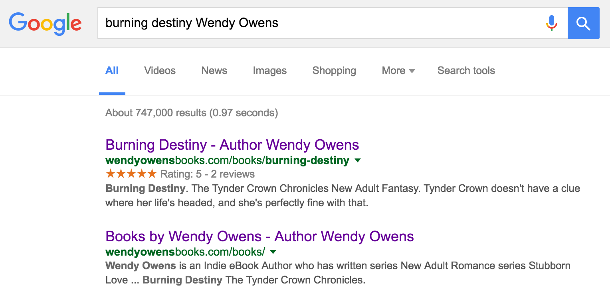
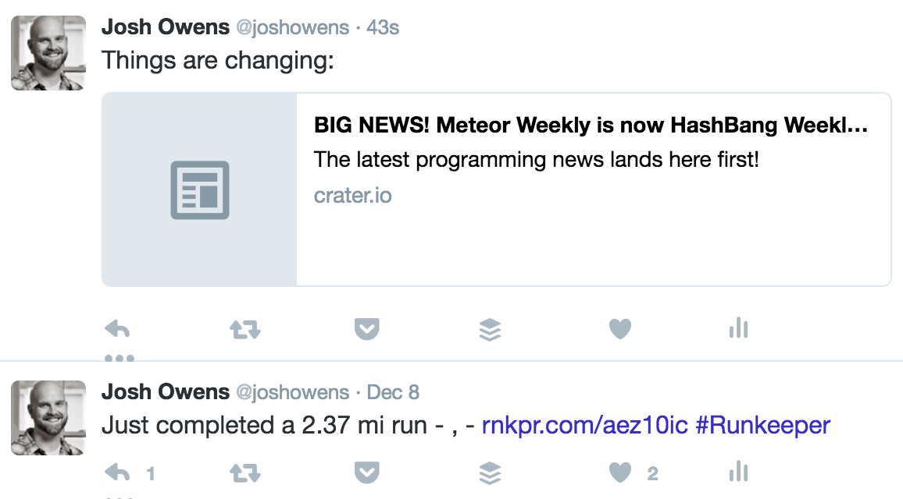
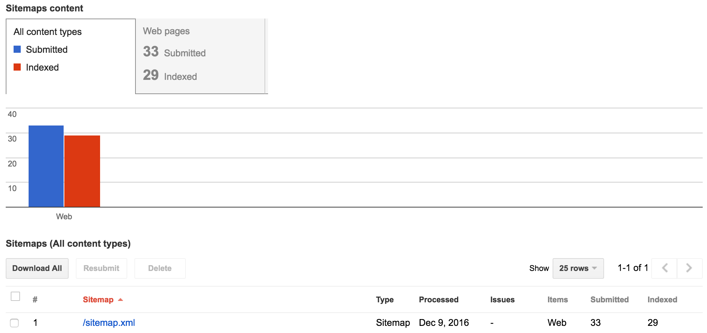

I recently spent some time diving back into SEO for a project and thought I would share some of the learnings I found. I always run these types of articles by a few people to see if they would find it helpful and most of them said they knew very little about SEO.

For the uninitiated, SEO stands for Search Engine Optimization. It is just a fancy way to say that you spend some time making sure your HTML and content match up with the goals of your site.


## Why should I care about SEO

Maybe you shouldn't? But we all want more traffic for our app. A few years back I spent a weekend working on SEO for a recipe app I built during Rails Rumble. We were getting steady recipe input and gaining new users at a decent rate. I knew that the time spent that weekend would pay off in the long run, but I had no idea. Within three months, we had grown our Google search traffic by 2000%, from 100 visitors a day to 2000 visitors a day.

Of course, that app existed long before social media meta tags had come along. Nowadays, I tend to include working on SEO as including tags for social media platforms too. Don't leave it to chance when someone shares your app on a social platform, take the time to setup the proper titles, descriptions, pictures, etc. You can make a nice looking share link if you just take a few minutes. And who doesn't want their stuff to stand out when it is shared on Twitter, Facebook, or Slack?

## Set up your json-ld

JSON-LD (JavaScript Object Notation for Linked Data) was something that was a bit new to me when I did my research. It is an easy and clean way to describe the content on a page so that Google and others can quickly consume and show your content correctly. Have you ever seen one of those fancy Google search results with the review stars listed under the link? Using JSON-LD is an easy way to get that working!

I recently used the [AggregateRating schema](https://schema.org/AggregateRating) to get a rich snippet to show up for my wife's site, she is an [author and writes books](http://wendyowensbooks.com). She already had all her books listed out on her site with separate pages, all we had to do was add JSON-LD data like this:


```js
<script type="application/ld+json">
{
  "@context": "http://schema.org",
  "@type": "Product",
  "name": "Wash Me Away",
  "description": "Monsters have a way of following you.",
  "url": "http://wendyowensbooks.com/books/wash-me-away",
  "aggregateRating": {
    "@type": "AggregateRating",
    "ratingValue": "4.5",
    "reviewCount": "15"
  }
}
</script>

```

The results went from dull and boring:


To a result with rich snippets like this:



## Social Media Optimization

Is SMO a real acronym? If not, it should be. Clean and well thought out social sharing data should be a top priority if you expect links to be shared out from your javascript app.

I run Crater.io and we recently moved the entire site over to React, and SEO was a big focus of that effort. We used React Helment and SSR to get the meta data onto each page. Here is an example of the social media meta tags being applied for Facebook (og tags) and Twitter (twitter tags):

```html
<meta data-react-helmet="true" property="og:type" content="article"/>
<meta data-react-helmet="true" property="og:url" content="https://crater.io/out?url=http:%2F%2Fhashbangweekly.okgrow.com%2F"/>
<meta data-react-helmet="true" property="og:image" content="https://crater.io//meteor_circle2.png"/>
<meta data-react-helmet="true" property="og:title" content="BIG NEWS! Meteor Weekly is now HashBang Weekly. Reporting on all things Meteor, GraphQL, and React"/>
<meta data-react-helmet="true" property="og:description" content="The latest programming news lands here first!"/>
<meta data-react-helmet="true" name="twitter:card" content="summary"/>
<meta data-react-helmet="true" name="twitter:image:src" content="https://crater.io//meteor_circle2.png"/>
<meta data-react-helmet="true" name="twitter:title" content="BIG NEWS! Meteor Weekly is now HashBang Weekly. Reporting on all things Meteor, GraphQL, and React"/>
<meta data-react-helmet="true" name="twitter:description" content="The latest programming news lands here first!"/>
```
As you can see, just adding a few meta tags at the top will give you a whole different look on twitter:



## Server-side rendering

Server Side Rendering, SSR for short, is **SUPER** important for SEO/SMO purposes. There are a few reasons why you want to spend time on SSR for SEO purposes:

1. Google uses loading speed for deciding where a page ranks in search results.
2. Google claims to render out JS, but I've seen an increase in search traffic since adding SSR
3. Twitter, Facebook, Slack, etc don't render out JS. We need to give them regular HTML with meta tags

The first reason might seem a bit weird, but in the case of something like Crater, we are detecting if the user isn't logged in, then we are serving up cached HTML. Nginx is WAY faster at serving static HTML off the disk vs waiting on something like Meteor or Express to build up HTML from React components on the server. That speed means something to Google, so give it to them as quick as you can. I have a longer post coming on SSR & caching soon.

The 2nd and 3rd reasons are intertwined. Google made a change a while back to support JS rendering of a site. But I've seen an uptick in search traffic since switching to straight cached HTML. On top of that places like Slack, Facebook, and Twitter don't put any time into JS rendering at all - they want plain HTML out of the box to get their meta tags.

## Sitemap or RSS feeds

Another easy tip is to **tell** Google about all the pages you have that it could index. There are two easy ways to accomplish that:

1. Sitemap.xml
2. RSS feeds

The sitemap.xml file is just a quick description of all the public facing pages in your app, you can [see a small example on my wife's author site](http://wendyowensbooks.com/sitemap.xml).

For RSS feeds, this might make more sense if you have a site that is being updated on an hourly, daily, or weekly basis with new content. On Crater.io we have a [front page RSS feed that shows the top stories on it](https://crater.io/feed.xml).

Once you have one of those two files, you can go into the Google Webmaster tool and add the sitemap or rss feed to let Google know about URLs that your site has. Google will then check those files for updates and feed new data straight to the Google Bots to consume new stuff for you! Here is an example of what the dashboard looks like for a sitemap of wendyowensbooks.com:



## Testing it all

It is important to test that your javascript app has all the things you want and each site that you care about can see it correctly. Here is a list of tools you can use (all free) to test out your site:

1. [Google Structured Data Testing tool](https://search.google.com/structured-data/testing-tool) - This lets you check out the JSON-LD and other microformats data you have
2. [Facebook Open Graph Debugger](https://developers.facebook.com/tools/debug/) - This enables you to check out what Facebook sees and how it will render out a share link
3. [Twitter card validator](https://cards-dev.twitter.com/validator) - Twitter will show you what it consumes out of your HTML. **REQUIRED** to get whitelisted for Twitter cards to work correctly.
4. [Google Webmaster](https://www.google.com/webmasters) - Handy app, add your website and make sure to add your sitemap or RSS feed to it. Also, you can try the Fetch as Google test, make sure you choose to 'render' too, you can see what google will consume.

## Don't slack off

Going over your public facing app may seem daunting or scary at first, but a few simple tweaks will leave your site in much better shape. Take a few minutes and implement some of the tips mentioned here on your React, Angular, or Vue.js app and get more traffic for minimal effort!

You can see all the tricks in action with the awesome new microframework for React called Next.js. I used Next.js to build a quick SSR enabled React site for the [upcoming Crater Conf in 2017](https://conf.crater.io)! Go take a look at it and be sure to 'view source' to see all these SEO tips in practice.
