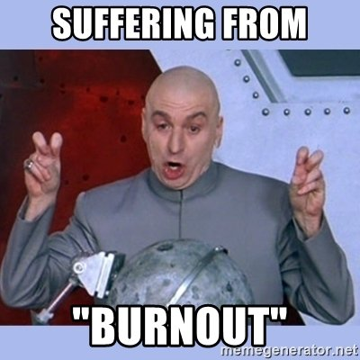

I guess it is no big secret that I've disappeared for almost a year now, posting here and there on twitter... I want to come clean and talk about what I've been doing. About why I stopped writing, teaching big classes, and doing the podcasts/videos.

**Spoiler Alert**: No, it's nothing as earth-shattering as my real identity being Satoshi Nakamoto, but it is something that affects a large number of programmers, and that's burning out. In a big way.

## Burnout?

Yip, around this time last year, my professional life had me pretty frazzled. I was full speed ahead with my training business around Meteor/React, podcasting, putting up youtube videos, and planning the next Crater Conf. All this was going on while I was spending 50-60% of my time doing freelance Meteor dev work. And I have to say; this arrangement was working great when Meteor was in high demand. I had my pick of clients, and it was a perfect scenario. My classes were always full - that meant the money wasn't hard to come by. Bills were paid, and I had enough money to more than feed my family while doing what I loved.

Then it happened, I saw the writing on the wall for Meteor.js in October of 2016. Searches and traffic by people interested in Meteor were in decline, and I barely broke even on Space Camp, an event that had sold out the year before. I had just started playing with React, and I was having fun with it... That is when I decided it was time to rename and refocus my business efforts away from Meteor. It turns out shifting a business' focus is hard. At least that was my experience; especially when you have a family relying on you to keep the income flowing. I lost interest in spending time on my core ideas. I wanted to do anything besides work on my business. I avoided sales work, writing Meteor apps, and finding advertisers.  I became obsessed with following politics, sports, homesteading, and more. I was so frustrated I began sabotaging my own business without realizing what I was doing.

## Making a switch

I told myself I could coast by, that things would pick up on their own. It was during that period of denial that my last Meteor client put a halt to work. I hadn't made any new classes to help income keep flowing, there was no longer a line of clients, and suddenly we began to see debts mounting as a result of the lack of income. There is nothing like the pressure financial instability can put on a marriage. I decided that it was time to take my head out of the sand and get my family back to a financially stable place. I started to contact people that might have local work for me. I hadn't worked in an office for years, but I thought the shift would help me get back on track and give me time to figure out the next moves for my training business. I hit paydirt; I started a new gig teaching apprentices at Kroger - as a contractor for my old company, Gaslight. I was learning Java, teaching React, and helping mentor two people. These two people were transitioning from other lines of work into programming. It was fun, it was fresh work for me, and I had the chance to continue to teach.

The great thing about joining a team is that it allowed me to remove a lot of the things that had led to my burn out. The teams I've worked on over the last 11 months purposely setup pair programming as a method to write better code and to help teach new people. By joining the team, I also removed the need for focusing on sales work. Worrying about the future of Meteor had plagued me on a daily basis, so switching to a stack that concentrated on React and Java let me remove those concerns.

Here we are, almost 12 months in, and I have learned a lot. I've learned about teaching people; how to write good code, how to work in a team, and how I can better explain a lot of the fundamentals of being a web developer. I've also had time for side projects and playing around with new tech. I've fallen in love more with React, Jest, Next.js, Gatsby, and other things. I've also figured out that I still hate Java as much as the first programming class I took in college 😆.

## More time for me

I know it sounds cheesy or cliche, but once I realized I was in the midst of burnout, I decided to start making time in my life for me. I bought a Nintendo Switch, spent more time playing video and board games with the family, began raising chickens, and so much more. Before I was only driven to create a successful business, but the problem was that my measuring stick was often other people’s success. I realized that just making room in my life for work wasn’t healthy and wasn't what success equaled for me. I needed to redefine what my success looked like, and that's precisely what I have done. Happiness and balance are keys to my picture of success now. I had to make room in my life for new things and to let old things die off. In one of my new hobbies, I began to learn about homesteading and growing my own food and just as the previous crops die off and fertilize the earth for next years planting and harvest I needed to do that in my own life. How else do I learn new things if I spend all my time on the same old thing that was no longer bearing fruit? I ended up stopping the podcasting, blogging, running crater, etc. Do I miss those things? Absolutely.

Eventually, I plan to do some of that again. This time I want to be thoughtful about how much time ideas are taking, the benefit it provides to the community, and if it drives value for my family and me. Now I have time to explore those new technologies and passions. I can start to sense patterns, like how much I enjoy javascript or writing tests for code.

## A new plan (professionally and personally)

On my journey, two things have become crystal clear to me; I love teaching people and want to do more of it & I miss working from home and building my own business. Kroger has been very supportive of me teaching, and I feel blessed the opportunity came when it did. It was exactly what I needed at that moment to continue growing as a developer and an entrepreneur. I've signed on for teaching a month long class in March to a group of younger devs and a pair of new apprentices. I'm also planning to spend more time on making tut videos on youtube, sharing how I use things like React, Next.js, and Jest. I've even started learning Kotlin for use at Kroger, so I guess we will see where that leads. I will be developing smaller online classes and video courses. Courses that cover a more diverse range of tech and not locking myself into Meteor or React only.

That covers my professional plan, but you may be asking, how do I plan to avoid burnout again? My answer? I will make time for my passions. I recently had a great time at a board game weekend and came home energized. I plan to continue to make time for board games and video games with the family. We have also made fitness and healthy eating a family goal. I will be running a few times a week and helping my wife pre-prep delicious, healthy meals for our family.

In the last talk I gave at MeteorCamp in NYC, I gave advice I've used to guide my career. Learn to embrace your curiosity and explore new technology - it will make you a stronger developer. I think if you lean into that curiosity, your learning will fuel your day to day life and help avoid burnout too.

Oh, and enjoy this vlog of recent me time at the board game weekend:

<iframe width="100%" height="315" src="https://www.youtube.com/embed/v9za938dIbs" frameborder="0" allow="autoplay; encrypted-media" allowfullscreen />
